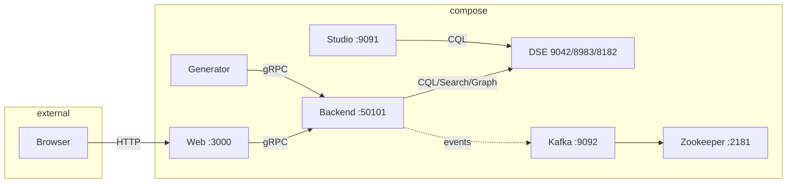

# KillrVideo All-in-One — End-to-End Playground

Run KillrVideo locally with Docker to learn **Apache Cassandra** / **DataStax Enterprise** (DSE) end-to-end: Web UI, Java microservices, schema bootstrap, and sample data generation.

---

## Full architecture (all components)

KillrVideo is a tiered video-sharing application. The [official high-level architecture](https://killrvideo.github.io/docs/guides/architecture/) defines these components (each typically run as a Docker container):

| Name | Technology | Execution | Description |
|------|------------|-----------|-------------|
| **WEB** | Node.js | Docker | The web UI of the application. Client (React, Redux, Falcor) + server (Express, gRPC). Port **3000**. |
| **STUDIO** | DataStax Studio | Docker | Notebook-oriented developer tool for running CQL and exploring DSE. Port **9091**. |
| **SERVICES** (Backend) | Node.js, Java, Python, C# | Docker for production | Microservices tier: business logic, exposes gRPC. Video Catalog, Comments, Ratings, Search, Statistics, Suggested Videos, Uploads, User Management. Port **50101**. |
| **GENERATOR** | Node.js | Docker | Job that collects videos from YouTube and saves them via SERVICES (gRPC). |
| **INTEGRATION TESTS** | Java (Cucumber) | IDE(s) | Integration tests that call gRPC services and assert behavior. |
| **DSE** | DataStax Enterprise | Docker (local) | Data tier: **Cassandra** (9042), **Search** (8983), **Graph** (8182). |
| **KAFKA** | Apache Kafka | Docker | Pub-sub messaging; some services use it for events (e.g. `YouTubeVideoAdded`). Port **9092**. |
| **ZOOKEEPER** | Apache ZooKeeper | Docker | Used by Kafka for configuration and coordination. Port **2181**. |

**Flow:** Browser → **WEB** (3000) → **SERVICES** (50101, gRPC) → **DSE** (9042/8983/8182). **GENERATOR** → **SERVICES** → **DSE**. Optional: **SERVICES** ↔ **KAFKA** (9092) ↔ **ZOOKEEPER** (2181) for event-driven features.

---

## What this repo runs (matches the architecture diagram)

**`docker-compose.yml`** includes all Docker components from the [architecture diagram](https://killrvideo.github.io/docs/guides/architecture/):

| Diagram component | In compose? | Service name | Port(s) |
|-------------------|-------------|--------------|---------|
| **WEB** | Yes | `web` | 3000 |
| **STUDIO** | Yes | `studio` | 9091 |
| **BACKEND** (Microservices) | Yes | `backend` | 50101 |
| **GENERATOR** | Yes | `generator` | — |
| **DSE** (Cassandra, Search, Graph) | Yes | `dse` | 9042, 8983, 8182 |
| **KAFKA** | Yes | `kafka` | 9092 |
| **ZOOKEEPER** | Yes | `zookeeper` | 2181 |
| **dse-config** (schema bootstrap) | Yes | `dse-config` | one-shot, then exits |
| **INTEGRATION TEST** (Cucumber) | No | — | Run from IDE per [official docs](https://killrvideo.github.io/docs/guides/architecture/) |

Flow: **Browser → Web → Backend (gRPC) → DSE**; **Generator → Backend → DSE**; **Backend** can use **Kafka** (9092) for pub-sub events; **Kafka** uses **Zookeeper** (2181).

---

## Workflow diagram (from this compose)

Based on `docker-compose.yml` and the running containers (web, backend, dse, generator, kafka, studio, zookeeper):

**ASCII flow:**

```
  Browser          Web              Backend           DSE
     |               |                  |              |
     | :3000         |                  |              |
     +──────────────►+                  |              |
                    |    :50101 gRPC    |              |
                    +──────────────────►+              |
                    |                   |  :9042 CQL   |
                    |                   |  :8983 Search|
                    |                   |  :8182 Graph |
                    |                   +──────────────►+
                    |                   |
                    |                   |  :9092 (events)
                    |                   +──────► Kafka ────► Zookeeper :2181
                    |                   |
  Generator         |                  |
     |    :50101    |                  |
     +──────────────┴──────────────────►
     
  Studio            |                  |
     |              |                  |
     +────────────────────────────────┴──────────────► DSE :9042
```

**Summary:** Browser → **Web** (3000) → **Backend** (50101); **Generator** → **Backend**; **Backend** → **DSE** (9042/8983/8182) and optionally → **Kafka** (9092); **Kafka** → **Zookeeper** (2181); **Studio** (9091) → **DSE**.

**Mermaid (for GitHub/GitLab):**



---

## How to implement — official documentation

Use the official KillrVideo docs to implement or extend each part of the architecture:

| Topic | Description | Link |
|-------|-------------|------|
| **High-level architecture** | Tiers, components, events (e.g. `YouTubeVideoAdded`), pub-sub | [Architecture overview](https://killrvideo.github.io/docs/guides/architecture/) |
| **Web tier implementation** | Web client (React, Redux, Falcor) and web server (Express, gRPC) | [Web Tier Implementation](https://killrvideo.github.io/docs/guides/web-tier/) |
| **Microservices tier implementation** | Services (Video Catalog, Comments, Ratings, Search, etc.), gRPC, DSE drivers | [Microservices Tier Implementation](https://killrvideo.github.io/docs/guides/microservices-tier/) |
| **Feature matrix** | Which features use Cassandra, Search, Graph, Kafka | [Feature Matrix](https://killrvideo.github.io/docs/guides/feature-matrix/) |
| **Docker and infrastructure** | Running full stack with Docker; DSE, Kafka, Zookeeper | [Docker and Infrastructure Dependencies](https://killrvideo.github.io/docs/guides/docker/) |
| **Service discovery** | How components find each other (e.g. `backend`, `dse`, `kafka`); env vars | [Service Discovery](https://killrvideo.github.io/docs/guides/service-discovery/) |
| **Using DataStax Studio** | Connecting Studio to DSE, running CQL, exploring schema | [Using DataStax Studio](https://killrvideo.github.io/docs/development/using-datastax-studio/) |
| **Repositories overview** | Source repos: killrvideo-web, killrvideo-java, killrvideo-dse-config, etc. | [Repositories Overview](https://killrvideo.github.io/docs/guides/repositories/) |
| **Pub-sub messaging** | Kafka, events, and service collaboration | [Pub-Sub Messaging](https://killrvideo.github.io/docs/development/pub-sub-messaging/) |
| **Generating sample data** | How the Generator works and how to run it | [Generating sample data](https://killrvideo.github.io/docs/development/generating-sample-data/) |

---

## Prerequisites

- **Docker** and **Docker Compose** (v2 recommended: `docker compose` with a space).
- A few minutes for first-time image pulls and DSE startup.

---

## Quick Start

```bash
cd killrvideo-all-in-one
docker compose up -d
```

- **Compose file:** `docker-compose.yml` (Java backend, fixed startup order).
- **Alternative:** `docker-compose-all-in-one.yml` (different image tags; same layout).

Startup order is configured so that:

1. **DSE** starts.
2. **dse-config** runs, creates the `killrvideo` keyspace and schema, then exits.
3. **Backend** starts only after dse-config has completed (`service_completed_successfully`).
4. **Web**, **Studio**, and **Generator** start after Backend (and dse-config) are ready.

---

## End-to-End: What to Do

### 1. Wait for services (important)

- **First 2–3 minutes:** DSE and dse-config. Backend will not start until dse-config has finished.
- **Next 1–2 minutes:** Backend and Web come up; Generator begins running.
- **Videos:** Generator adds sample data on a schedule; allow **3–5 minutes** after Backend is up before expecting videos on the site.

### 2. Open the UIs

| URL | What it is |
|-----|------------|
| **http://localhost:3000** | KillrVideo web app — browse latest videos, search, sign up, comment. |
| **http://localhost:9091** | DataStax Studio — run CQL, inspect keyspaces/tables. |

On Docker Desktop / docker-machine, use the host IP instead of `localhost` if needed.

### 3. Confirm Backend is healthy

```bash
docker logs killrvideo-all-in-one-backend-1 --tail 30
```

You should see Spring Boot started with no `Keyspace killrvideo does not exist` error.

### 4. Confirm Generator is running

```bash
docker logs killrvideo-all-in-one-generator-1 --tail 20
```

Look for `Started scheduler` and `Found service VideoCatalogService at backend:50101`. Occasional gRPC state messages are normal.

### 5. Play in the Web UI

- **Latest / Browse** — list of videos (after Generator has run a few minutes).
- **Search** — once Search indexes are ready.
- **Sign up / Sign in** — create a user and comment or rate videos.

### 6. Play in DataStax Studio

- Create a connection to **DSE** (host: `dse` or `localhost` if you connect from the host; port **9042**).
- Run CQL against keyspace `killrvideo`, e.g.:

  ```cql
  USE killrvideo;
  DESCRIBE TABLES;
  SELECT * FROM videos LIMIT 10;
  ```

### 7. Restart or reset

```bash
docker compose down
docker compose up -d
```

Give it the same 2–5 minutes for full startup and sample data.

---

## Pushing data via gRPC (into C*)

You can push users and videos into Cassandra by calling the KillrVideo **backend gRPC API** (port **50101**). The backend writes to DSE (e.g. `videos`, `latest_videos`, `users`). No DSBulk or CQL needed.

**Want a simple explanation?** See **[Understanding .proto, gRPC, and what gets stored in the DB](docs/Understanding-gRPC-and-Data.md)** (what is .proto, what is gRPC, how the script uses them, and which tables get which data).  
**Flow and protoc:** See **[Flow: Cassandra ↔ gRPC response, and where protoc fits](docs/Flow-Cassandra-gRPC-and-Protoc.md)** (one Cassandra row → proto message → gRPC response; line diagram; where the protoc compiler is used). To **run protoc** in this repo or **build killrvideo-java** (which runs protoc), see section 4 in that doc: `./scripts/run_protoc.sh` and `./scripts/build_killrvideo_java.sh`.

### 1. Prerequisites

- **Backend running:** `docker compose up -d` and backend healthy (see [Quick Start](#quick-start)).
- **grpcurl** (CLI for gRPC):  
  - macOS: `brew install grpcurl`  
  - Or: [grpcurl releases](https://github.com/fullstorydev/grpcurl/releases)

### 2. Protos in this repo

This repo includes minimal proto definitions under **`protos/`** (from [killrvideo-service-protos](https://github.com/KillrVideo/killrvideo-service-protos)) so you can call the backend without cloning another repo:

- `protos/common/common_types.proto` — `Uuid`
- `protos/video-catalog/video_catalog_service.proto` — `VideoCatalogService` (e.g. `SubmitYouTubeVideo`)
- `protos/user-management/user_management_service.proto` — `UserManagementService` (e.g. `CreateUser`)
- `protos/google/protobuf/timestamp.proto` — for timestamp types

### 3. Video ID vs YouTube ID

When you run the script you see both **Video ID** and **YouTube ID**; they are not the same:

| Term | Meaning |
|------|--------|
| **YouTube ID** | The ID of the video **on YouTube** (e.g. `dQw4w9WgXcQ`). It comes from the URL (`youtube.com/watch?v=...`). It identifies which YouTube video to play. The same for that video no matter who adds it. |
| **Video ID** | KillrVideo’s **own unique ID** (a UUID) for this **catalog entry** in the database. The script generates a new one each run. So each “add video” creates a new row with a new Video ID, even if you use the same YouTube ID. |

In short: **YouTube ID** = which video on YouTube; **Video ID** = KillrVideo’s ID for that single row in `videos` / `latest_videos`.

### 4. Protobuf data (who generates it)

- **.proto files** in this repo are the **definitions** (schema); they are not generated here.
- **Protobuf data on the wire:** The script sends **JSON** to **grpcurl** (e.g. `-d '{"video_id":{"value":"..."}, ...}'`). grpcurl uses the .proto files to **convert that JSON into protobuf binary** and send it to the backend. So the actual request/response bytes are **protobuf data**; grpcurl generates (encodes) it from JSON when sending, and decodes it when receiving.
- **Generated code:** The backend (Java) uses **code generated from the same .proto files** (e.g. via `protoc` in the killrvideo-java project). This repo does **not** run a code generator; it only uses the .proto files so grpcurl knows how to encode and decode messages.

### 5. One-shot: create user + submit YouTube video

From the repo root (`killrvideo-all-in-one`):

```bash
chmod +x scripts/grpc_push_video.sh
./scripts/grpc_push_video.sh
```

This script uses **grpcurl** to:

1. **GetLatestVideoPreviews** (optional) — get an existing user ID so re-runs don’t create duplicate users.
2. **CreateUser** — only if no existing user was found.
3. **SubmitYouTubeVideo** — add one YouTube video; the backend writes to `videos` (and may write `latest_videos`).
4. **CQL insert** — if Docker is available, inserts the video into `latest_videos` with today’s UTC date so it **always shows on the UI “Latest” list**. Set `SKIP_LATEST_VIDEOS_INSERT=1` to skip.

Then refresh **http://localhost:3000** to see the new video under Latest.

Optional env vars: `GRPC_HOST`, `GRPC_PORT`, `USER_ID`, `VIDEO_ID`, `YOUTUBE_ID`, `SKIP_LATEST_VIDEOS_INSERT`.

### 6. Seeing JSON, protobuf binary, and Java objects when running the script

When you run the script, you can see the **request JSON** and **response** in the terminal. Optionally you can see more detail and where **protobuf binary** and **Java objects** come in.

**Request JSON and response (verbose)**

Run with **`DEBUG_GRPC=1`** so the script prints the JSON payload before each gRPC call and runs grpcurl with **`-v`** (verbose), so you see the request and response in the terminal:

```bash
DEBUG_GRPC=1 ./scripts/grpc_push_video.sh
```

You will see:

- **Request (JSON)** — the exact JSON the script sends (e.g. for CreateUser and SubmitYouTubeVideo). grpcurl converts this to protobuf binary before sending.
- **Response** — the decoded response from the backend (e.g. empty `{}` for CreateUser/SubmitYouTubeVideo, or the list of video previews for GetLatestVideoPreviews).

**Protobuf binary (on the wire)**

The actual bytes sent over the network are **protobuf-encoded**, not JSON. grpcurl does the encoding (JSON → protobuf) before sending and decoding (protobuf → JSON) when printing. To inspect the raw protobuf binary you need a network-level tool, for example:

- **Wireshark** (filter: `tcp.port == 50101`) to capture the stream; gRPC uses HTTP/2 and the body is protobuf binary.
- A gRPC debug proxy (e.g. **grpc-dump** or similar) that logs request/response bytes.

So: in the script with `DEBUG_GRPC=1` you see the **JSON** (what gets encoded) and the **decoded response**; the **binary** is on the wire between grpcurl and the backend.

**Deserialized Java objects (on the backend)**

The backend receives the protobuf bytes and **deserializes them into Java objects** (e.g. `SubmitYouTubeVideoRequest`). That happens inside the Java process; you cannot see those objects from the script. To see backend-side activity (including how the request is handled):

1. Ensure the backend runs with debug logging, e.g. in `docker-compose.yml` the backend already has `KILLRVIDEO_LOGGING_LEVEL: debug`.
2. While running the script, stream the backend logs in another terminal:

   ```bash
   docker logs -f killrvideo-all-in-one-backend-1
   ```

You will see gRPC and application logs; the request is handled as Java objects after deserialization.

**Summary**

| What | Where you see it |
|------|-------------------|
| **Request JSON** | In the terminal when you run `DEBUG_GRPC=1 ./scripts/grpc_push_video.sh` (printed before each grpcurl call). |
| **Response (decoded)** | Same run: grpcurl `-v` prints the response (e.g. `{}` or list of previews). |
| **Protobuf binary** | On the wire; use Wireshark or a gRPC proxy to capture the bytes. |
| **Java objects (deserialized)** | Inside the backend; use `docker logs -f <backend-container>` with debug logging to see backend activity. |

### 7. Manual grpcurl examples

**List services** (if the backend supports gRPC reflection):

```bash
grpcurl -plaintext localhost:50101 list
```

**Create a user:**

```bash
grpcurl -plaintext \
  -import-path protos \
  -proto user-management/user_management_service.proto \
  -d '{"user_id":{"value":"YOUR-UUID"},"first_name":"Jane","last_name":"Doe","email":"jane@example.com","password":"secret"}' \
  localhost:50101 \
  killrvideo.user_management.UserManagementService/CreateUser
```

**Submit a YouTube video** (use the same `user_id` as above or an existing user UUID from `killrvideo.users`):

```bash
grpcurl -plaintext \
  -import-path protos \
  -proto video-catalog/video_catalog_service.proto \
  -d '{"video_id":{"value":"VIDEO-UUID"},"user_id":{"value":"USER-UUID"},"name":"My video","description":"Added via gRPC","tags":["demo"],"you_tube_video_id":"dQw4w9WgXcQ"}' \
  localhost:50101 \
  killrvideo.video_catalog.VideoCatalogService/SubmitYouTubeVideo
```

UUIDs are v4-style strings (e.g. `a1b2c3d4-e5f6-4789-a012-345678901234`). Get an existing `userid` from DataStax Studio: `SELECT userid FROM killrvideo.users LIMIT 5;`.

### 8. Python or other languages

To use **Python** (or another language) instead of grpcurl:

1. Get the full proto definitions: clone [killrvideo-service-protos](https://github.com/KillrVideo/killrvideo-service-protos) (or use the `protos/` layout above).
2. Generate client code from the `.proto` files (see [Generating Service Code](https://killrvideo.github.io/docs/development/generate-service-code/)).
3. Create a channel to `localhost:50101` (plaintext) and call `UserManagementService.CreateUser` and `VideoCatalogService.SubmitYouTubeVideo` with the same request shapes as in the grpcurl examples.

The [killrvideo-python](https://github.com/KillrVideo/killrvideo-python) repo contains a full Python service implementation and generated stubs you can reuse as a client.

### 9. gRPC returns `NoHostAvailableException: All host(s) tried for query failed`

That error means the **backend** got your gRPC request but **could not reach DSE** (no host was tried = connection/DNS from backend to Cassandra). Fix it like this:

1. **Use a compose file that sets DSE contact points.** Both `docker-compose.yml` and `docker-compose-all-in-one.yml` in this repo set `KILLRVIDEO_DSE_CONTACT_POINTS: dse`. If you use a different compose file, add that env to the `backend` service so the backend connects to the DSE container by name.

2. **Ensure DSE is up and CQL is ready.** DSE can take 2–3 minutes to accept connections. Check:
   ```bash
   docker compose ps
   docker logs killrvideo-all-in-one-dse-1 --tail 20
   ```
   From the host you can test CQL: `nc -zv localhost 9042` or use Studio at http://localhost:9091.

3. **Restart the backend** so it (re)connects to DSE, then rerun the script:
   ```bash
   docker compose restart backend
   sleep 30
   ./scripts/grpc_push_video.sh
   ```

4. If it still fails, do a full cycle so dse-config runs and the keyspace exists, then bring backend up after:
   ```bash
   docker compose down
   docker compose up -d
   # Wait 3–5 min for DSE + dse-config + backend
   docker logs killrvideo-all-in-one-backend-1 --tail 30
   ./scripts/grpc_push_video.sh
   ```

---

## Troubleshooting

| Symptom | What to check |
|--------|----------------|
| **"These aren't the videos you are looking for"** on the home page | Empty video list. Either wait 5–10 min for the Generator to add videos, or run the checks below. |
| **No videos on http://localhost:3000** | Wait 3–5 min after Backend is up. Ensure Generator logs show `Started scheduler` and no repeated `ECONNREFUSED` to DSE. |
| **Backend logs: `Keyspace killrvideo does not exist`** | Backend started before dse-config finished. Use `docker compose down` then `docker compose up -d` so the configured startup order runs (Backend depends on `dse-config` with `service_completed_successfully`). |
| **Web: `VideoCatalogService has state TRANSIENT_FAILURE`** | Backend is not running or crashed. Check `docker logs killrvideo-all-in-one-backend-1`. Fix the keyspace/startup order as above, then restart. |
| **Generator: `ECONNREFUSED` to `dse:9042`** | DSE wasn’t ready when Generator started. Generator has retries; if it later shows `Started scheduler`, it’s fine. For a clean run, use `docker compose down` and `up -d` again. |

| **RECENT VIDEOS still blank** (data in Studio) | Set `KILLRVIDEO_DSE_CONTACT_POINTS: dse` on backend in compose, then `docker compose restart backend`. See "Verify Docker when RECENT VIDEOS is blank" below. |

Useful log commands:

```bash
docker logs killrvideo-all-in-one-backend-1    --tail 50
docker logs killrvideo-all-in-one-generator-1  --tail 50
docker logs killrvideo-all-in-one-dse-config-1
docker logs killrvideo-all-in-one-web-1        --tail 30
```

### Verify Docker when RECENT VIDEOS is blank

If you've loaded `videos` and `latest_videos` (e.g. via killrvideo-cdm + DSBulk) and Studio shows rows for `WHERE yyyymmdd = 'YYYYMMDD'`, but http://localhost:3000 RECENT VIDEOS is still empty:

1. **Backend must reach DSE by hostname `dse`.** If you use **docker-compose-all-in-one.yml**, the backend needs `KILLRVIDEO_DSE_CONTACT_POINTS: dse` in its `environment`. Without it, the backend may try to connect to localhost and never see your data.

2. **Restart the backend** after adding or fixing that env:
   ```bash
   cd killrvideo-all-in-one
   docker compose -f docker-compose-all-in-one.yml restart backend
   ```
   Wait ~30 seconds, then refresh http://localhost:3000.

3. **Confirm backend talks to DSE:** While loading the RECENT VIDEOS page, run `docker logs killrvideo-all-in-one-backend-1 --tail 20`. You should see no connection errors. If you see "Contact point unresolved" or similar, the backend is not using hostname `dse`.

4. **Confirm web talks to backend:** If the web shows `VideoCatalogService has state TRANSIENT_FAILURE`, the web cannot reach the backend (check backend is running and port 50101 is exposed).

| **Backend only shows createUser, no video activity** | Generator may not be submitting videos. Use `scripts/insert-one-test-video.cql` (see below) or load [killrvideo-cdm](https://github.com/KillrVideo/killrvideo-cdm). |

### Empty `killrvideo.videos` table?

- **killrvideo-data** = **schema only** (CQL DDL). The **dse-config** container already applies it, so keyspace and tables exist. You don’t push this repo for *data* — it doesn’t contain rows.
- **killrvideo-cdm** = **sample dataset** (e.g. `videos.csv`) for [Cassandra Dataset Manager (CDM)](https://github.com/KillrVideo/killrvideo-cdm). Use this if you want to load pre-built rows instead of waiting on the Generator.
- **Generator** = intended path: it should insert users, videos, and comments via gRPC. If `videos` is still empty after 10+ minutes, check generator logs for video-related activity or errors; you can optionally load data from **killrvideo-cdm** via CDM for immediate data.

**Insert a test video manually:** Use **`scripts/insert-one-test-video.cql`**: in Studio run `SELECT userid FROM killrvideo.users LIMIT 1;`, then in the script replace `YOUR_USERID_HERE` with that UUID (in both INSERTs) and set `yyyymmdd` to today (e.g. `20260311`). Run both INSERTs, then refresh http://localhost:3000. If you get column errors, run `DESCRIBE TABLE killrvideo.videos` and `DESCRIBE TABLE killrvideo.latest_videos` and adjust the script.

---

## Load full sample data (CDM or DSBulk)

To get **many videos** instead of one manual insert, use the [killrvideo-cdm](https://github.com/KillrVideo/killrvideo-cdm) dataset. From your **host**, DSE is at **localhost:9042**.

### Option A: Cassandra Dataset Manager (CDM)

1. Install CDM (Python 3): `pip install cassandra-dataset-manager` (or see [CDM on GitHub](https://github.com/rustyrazorblade/cdm) if the package name differs).
2. Point CDM at DSE: set contact host to `127.0.0.1` and port to `9042` (env vars or CDM config, e.g. `CASSANDRA_HOST`, `CASSANDRA_PORT`).
3. Run: `cdm update` then `cdm install killrvideo` (use the dataset name CDM lists if different).
4. Refresh http://localhost:3000.

### Option B: DSBulk + killrvideo-cdm repo

1. **Install DSBulk** (Java 8+): download the tarball from [DSBulk releases](https://github.com/datastax/dsbulk/releases) — use tag **1.11.0** (no `v` prefix). Correct URL:
   ```bash
   curl -L -o dsbulk.tar.gz https://github.com/datastax/dsbulk/releases/download/1.11.0/dsbulk-1.11.0.tar.gz
   tar -xzf dsbulk.tar.gz
   cd dsbulk-1.11.0
   ./bin/dsbulk --version
   ```
   Use `./bin/dsbulk` in place of `dsbulk` below, or add `export PATH="$PATH:$(pwd)/bin"` so `dsbulk` is on your PATH.
2. Clone the dataset: `git clone https://github.com/KillrVideo/killrvideo-cdm.git && cd killrvideo-cdm`.
3. Load CSVs into the existing `killrvideo` keyspace. Example for `videos`:
   ```bash
   dsbulk load -url data/videos.csv -k killrvideo -t videos -h 127.0.0.1 -port 9042
   ```
   If column names in the CSV don't match the table, add `--schema.mapping` (see DSBulk docs). Use `DESCRIBE TABLE killrvideo.videos` in Studio to get exact column names. Load other tables (e.g. `users`, `latest_videos`) as needed for full data.
4. Refresh http://localhost:3000.

The UI "Latest" list reads from `latest_videos`; if you only load `videos`, you may need to populate `latest_videos` too (see `scripts/insert-one-test-video.cql` for column names).

---

## Compose files

- **`docker-compose.yml`** — Full diagram stack: Web, Backend, Studio, Generator, DSE, dse-config, **Kafka**, **Zookeeper**. DSE uses persistent volume `dse-data`. Backend has `KILLRVIDEO_DSE_CONTACT_POINTS: dse` and `KILLRVIDEO_KAFKA_BOOTSTRAP_SERVERS: kafka:9092`.
- **`docker-compose-all-in-one.yml`** — Same services with `platform: linux/amd64` for ARM Macs (no Kafka/Zookeeper in that file).

---

## References

- [KillrVideo — High-level architecture](https://killrvideo.github.io/docs/guides/architecture/) — tiers, components, ports, events.
- [Web Tier Implementation](https://killrvideo.github.io/docs/guides/web-tier/) | [Microservices Tier](https://killrvideo.github.io/docs/guides/microservices-tier/) | [Feature Matrix](https://killrvideo.github.io/docs/guides/feature-matrix/) | [Docker and Infrastructure](https://killrvideo.github.io/docs/guides/docker/) | [Service Discovery](https://killrvideo.github.io/docs/guides/service-discovery/) | [Using DataStax Studio](https://killrvideo.github.io/docs/development/using-datastax-studio/) | [Repositories Overview](https://killrvideo.github.io/docs/guides/repositories/).
- [Generating sample data](https://killrvideo.github.io/docs/development/generating-sample-data/) — how the Generator works.

**KillrVideo** is open source (Apache 2.0). This README extends the [upstream all-in-one](https://github.com/KillrVideo/killrvideo-all-in-one) with the full component list, implementation doc index, startup order, persistence, and data-loading steps.
