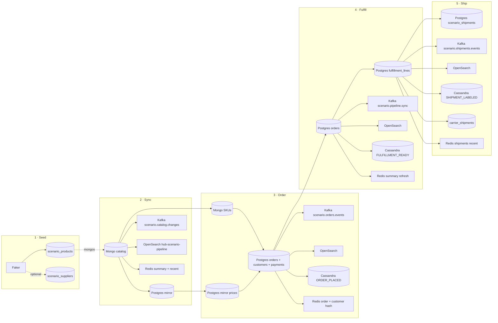
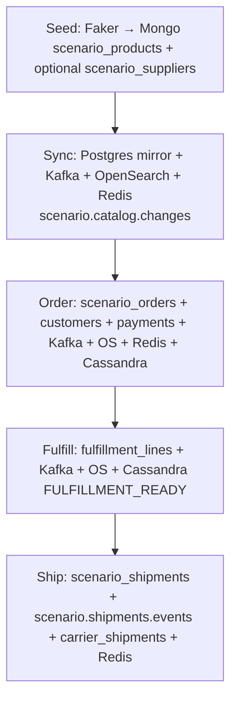

# Multi-DB scenario flow (Faker + pipelines)

This document explains **which diagrams** describe the **http://localhost:8888/scenario** page, **how many integration paths** run, **source vs sink** roles, and **whether the Mongo catalog collection is sharded**.

Implementation: [`demo-ui/scenario.py`](demo-ui/scenario.py) (FastAPI handlers in [`demo-ui/app.py`](demo-ui/app.py)).

---

## 1. Which diagram explains this flow?

| Where | What to look at |
|--------|------------------|
| **Live UI** | **Scenario** → **Pipeline line diagram** (horizontal spine, steps **1–5**) and the **vertical “Flow diagram”** in the sidebar (same five stages top → bottom). |
| **This repo (static)** | **[`diagrams/01-sequence-order-flow.mmd`](diagrams/01-sequence-order-flow.mmd)** — broader order + CDC story. For **Mongo-heavy** paths see **`03-flowchart-mongo-path.mmd`**, for **Postgres / fulfillment** see **`02-flowchart-postgres-path.mmd`**, for **Cassandra + Redis + OpenSearch** see **`04-flowchart-cassandra-redis-os.mmd`**. Overview including **`scenario.*`** vs Connect: **`06-flowchart-multi-db-faker-connect-overview.mmd`**. Rendered **SVG** versions sit alongside each **`.mmd`** file. |

The hub’s main **[`README.md`](README.md)** also inlines those SVGs and collapsible Mermaid blocks for GitHub.

---

## 2. “Connectors” — what is actually running?

There are **two different meanings** of “connector”:

### A) Kafka Connect JVM connectors (Debezium, JDBC sink, …)

- The **Multi-DB scenario does not require any Kafka Connect connector** to move data. The demo uses **in-process Python**: **`kafka-python`** producers, **PyMongo**, **psycopg**, **HTTP** to OpenSearch, **redis-py**, **Cassandra driver**.
- The stack **can** run **Kafka Connect** for other demos (e.g. **`../mongo-kafka/`** with **`demo.demo_items`**). That is **separate** from the **Scenario** buttons unless you explicitly register and run those connectors.

### B) Logical “pipelines” triggered from the UI (recommended wording)

When you use **Scenario**, you run **five explicit operations** (five numbered pipeline buttons plus order form / quick order). Think of them as **five integration steps**, not Kafka Connect tasks:

| # | Python entry | Role |
|---|----------------|------|
| 1 | `op_seed_catalog` | Load generator → Mongo (`scenario_products`, optional `scenario_suppliers`) |
| 2 | `op_pipeline_mongo_to_postgres_and_kafka` | **Batch sync**: Mongo → Postgres mirror + Kafka + OpenSearch + Redis (+ MSSQL MERGE when configured) |
| 3 | `op_place_order` | **OLTP**: Postgres `scenario_orders` + `scenario_customers` + `scenario_payments` + Kafka + OpenSearch + Cassandra + Redis |
| 4 | `op_pipeline_postgres_to_fulfillment_and_kafka` | **Batch sync**: Postgres fulfillment lines + Kafka + OpenSearch + Cassandra (+ Redis summary refresh) |
| 5 | `op_pipeline_fulfilled_to_shipments` | **Shipping**: Postgres `scenario_shipments` + `scenario.shipments.events` + OpenSearch + Cassandra timeline + `scenario_carrier_shipments` + Redis `scenario:shipments:recent` |

**None** of these are “Kafka Connect connectors” unless you replace them with Connect in production.

---

## 3. Source vs sink (per step)

Full **Kafka** topic names ( **`scenario.`** prefix ):

- `scenario.catalog.changes`
- `scenario.orders.events`
- `scenario.pipeline.sync`
- `scenario.shipments.events`

**OpenSearch** index for mirrored events: **`hub-scenario-pipeline`**.

### Step 1 — Seed Mongo catalog

| Role | System | Detail |
|------|--------|--------|
| **Source** | **Faker** (in memory) | Synthetic product + supplier fields |
| **Sink** | **MongoDB** | `demo.scenario_products`; optional `demo.scenario_suppliers` |

Redis dashboard summary refreshed after seed.

### Step 2 — Sync catalog → Postgres + Kafka + OpenSearch + Redis

| Role | System | Detail |
|------|--------|--------|
| **Source** | **MongoDB** | Reads up to **80** docs from `demo.scenario_products` |
| **Sink** | **PostgreSQL** | UPSERT `scenario_catalog_mirror` |
| **Sink** | **Kafka** | Produce `scenario.catalog.changes` |
| **Sink** | **OpenSearch** | Index same logical payload (`mongo→kafka+os`) |
| **Sink** | **Redis** | `LPUSH` recent list `scenario:kafka:recent`, refresh `scenario:dashboard:summary` |

### Step 3 — Place order

| Role | System | Detail |
|------|--------|--------|
| **Source** | **MongoDB** | SKUs (up to 50 read) |
| **Source** | **PostgreSQL** | Prices from `scenario_catalog_mirror` when available |
| **Sink** | **PostgreSQL** | Insert `scenario_orders`; UPSERT `scenario_customers`; INSERT `scenario_payments` |
| **Sink** | **Kafka** | `scenario.orders.events` |
| **Sink** | **OpenSearch** | Mirror (`api→kafka+os`) |
| **Sink** | **Cassandra** | `scenario_timeline` — `ORDER_PLACED` |
| **Sink** | **Redis** | `scenario:order:latest:<order_ref>`, `scenario:customer:<email>`, recent list + dashboard summary |

### Step 4 — Fulfillment rows + Kafka + OpenSearch + Cassandra

| Role | System | Detail |
|------|--------|--------|
| **Source** | **PostgreSQL** | Orders **without** rows in `scenario_fulfillment_lines` yet (up to 20) |
| **Sink** | **PostgreSQL** | Insert `scenario_fulfillment_lines` |
| **Sink** | **Kafka** | `scenario.pipeline.sync` |
| **Sink** | **OpenSearch** | Mirror (`postgres→kafka+os`) |
| **Sink** | **Cassandra** | `FULFILLMENT_READY` on `scenario_timeline` |
| **Sink** | **Redis** | Dashboard summary refresh only |

### Step 5 — Shipping labels

| Role | System | Detail |
|------|--------|--------|
| **Source** | **PostgreSQL** | Fulfilled orders with **no** `scenario_shipments` row yet |
| **Sink** | **PostgreSQL** | Insert `scenario_shipments` |
| **Sink** | **Kafka** | `scenario.shipments.events` |
| **Sink** | **OpenSearch** | Mirror (`postgres→kafka+os`) |
| **Sink** | **Cassandra** | `SHIPMENT_LABELED` + insert `scenario_carrier_shipments` |
| **Sink** | **Redis** | `scenario:shipments:recent` list + dashboard summary |

---

## 4. Is `demo.scenario_products` sharded?

- **`hub-demo-ui`** uses **`MONGO_URI=mongodb://mongo-mongos1:27017`**, i.e. a **sharded-cluster router** (**mongos**), not a single standalone `mongod`.
- The script **`../mongo-kafka/prepare-demo-collections.sh`** enables sharding on database **`demo`** and runs **`sh.shardCollection`** only for:
  - `demo.demo_items`
  - `demo.demo_items_from_kafka`  
  (used by the **mongo-kafka / Debezium** demo path.)

**`demo.scenario_products`** is **created by the Scenario seed** when you first insert documents. It is **not** included in that **shardCollection** script. On a sharded cluster, such a collection is an **unsharded** collection: it lives on the **primary shard** until you explicitly call **`sh.shardCollection("demo.scenario_products", …)`**.

**Summary:** The **cluster** is sharded; the **scenario catalog collection** in this repo is **not configured as a sharded collection**—it is a normal collection accessed through **mongos**. To shard it like `demo_items`, add an idempotent **`shardCollection`** block for `demo.scenario_products` (and optional compound/hashed key) to your init script or run it once via **mongosh**.

---

## 5. Diagram: five-step pipeline (Mermaid)

---

## 6. Diagram: vertical summary (same as UI sidebar)

---

## 7. Quick reference

| Artifact | Value |
|----------|--------|
| UI | `http://localhost:8888/scenario` |
| Catalog collections | `demo.scenario_products`, `demo.scenario_suppliers` |
| Postgres tables | `scenario_catalog_mirror`, `scenario_orders`, `scenario_fulfillment_lines`, `scenario_customers`, `scenario_payments`, `scenario_shipments` |
| Cassandra | `demo_hub.scenario_timeline`, `demo_hub.scenario_carrier_shipments` |
| Redis keys | `scenario:dashboard:summary`, `scenario:kafka:recent`, `scenario:order:latest:*`, `scenario:customer:*`, `scenario:shipments:recent` |

For ports, stack startup, and OpenSearch **Discover**, see **[`README.md`](README.md)** and **[`../../../docker-compose.yml`](../../../docker-compose.yml)**.
