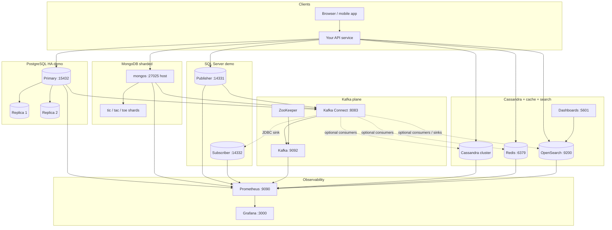
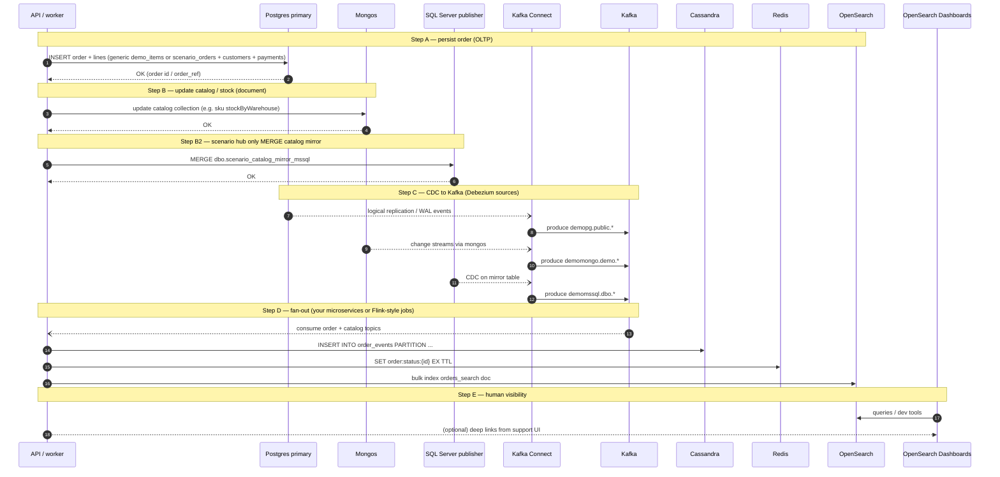
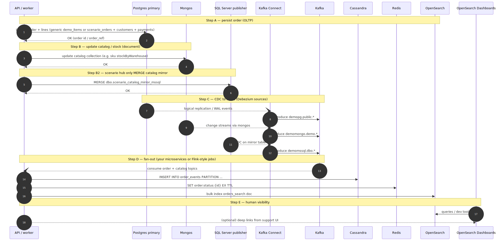
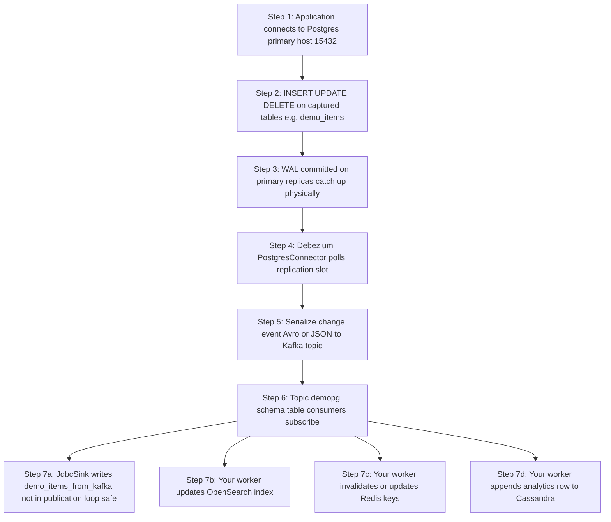
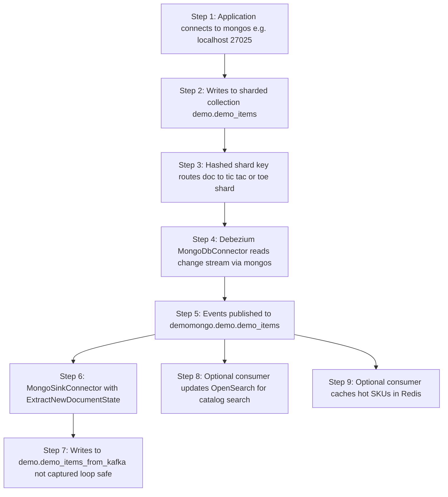
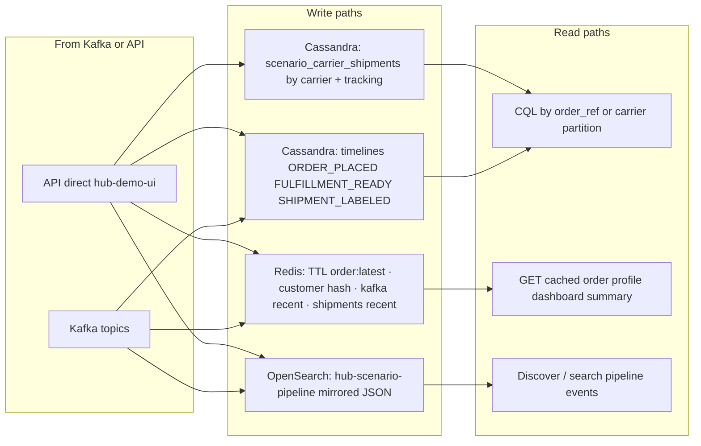
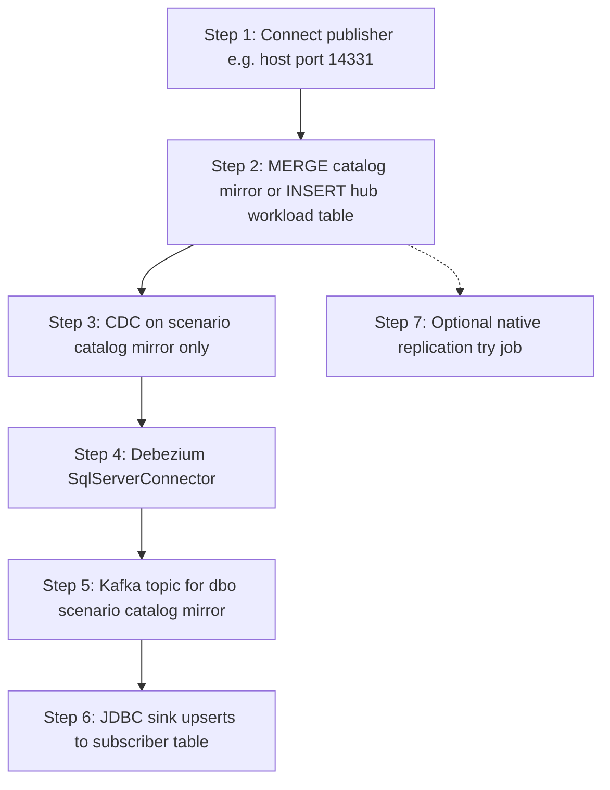
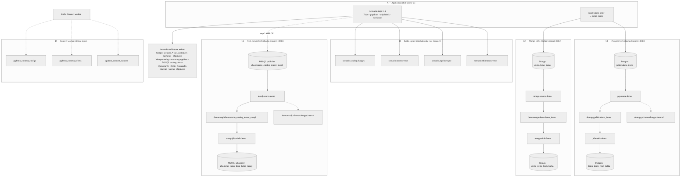

# Realtime orders & search hub (reference scenario)

**Common to Compose + Kubernetes:** [`../../../docs/hub-and-data-flow.md`](../../../docs/hub-and-data-flow.md) · [`../../../docs/compose-vs-kubernetes.md`](../../../docs/compose-vs-kubernetes.md) · [`../../../docs/README.md`](../../../docs/README.md)

This folder describes a **single coherent real-time story** across everything in **`../../../docker-compose.yml`**:

| System | Role in this scenario |
|--------|------------------------|
| **PostgreSQL** | System of record for **orders** and payments-oriented rows; **Debezium** captures `demo_items`-style tables to Kafka (same pattern as **`../postgres-kafka/`**). |
| **MongoDB (sharded)** | Catalog / documents that change often; **Debezium Mongo** → Kafka (**`../mongo-kafka/`**). |
| **Kafka + Connect** | Event backbone; source and sink connectors you already run. |
| **Cassandra** | High-volume **order events** / timeline (append-heavy, wide rows)—good fit for MCAC metrics and **`../cassandra/`** topology. |
| **Redis** | **Hot cache**: latest order status, product availability snapshot, rate limits (**`../redis/README.md`**). |
| **OpenSearch** | **Full-text search** and customer-facing browse (indexes built from Kafka topics or denormalized writes). |
| **SQL Server (×2)** | **Publisher + subscriber** (host **14331** / **14332**): scenario **catalog mirror** + optional **workload** table on publisher; **Debezium SQL Server** → Kafka → **JDBC sink** to subscriber (**`../mssql-kafka/`**). **Prometheus** scrapes **`mssql-exporter-*`** (job **`mssql_demo`**). |
| **Prometheus + Grafana** | End-to-end observability (**`../observability/`**); SQL Server dashboard **`mssql-demo-overview.json`**. |

This is a **reference architecture** you can implement incrementally: the repo already brings up the infrastructure; connectors and app code can follow the flows below.

---

## Scenario in one paragraph

A customer places an order: the **API** persists the order in **Postgres** and updates **Mongo** catalog stock. **Debezium** streams both changes to **Kafka**. The **hub scenario** can also **MERGE** the same catalog into **SQL Server** on the publisher; **Debezium SQL Server** captures that table to Kafka and a **JDBC sink** can apply changes to the subscriber. A **consumer** (or **sink**) updates **OpenSearch** so the “my orders” and catalog search UI stay current; another path writes an **event** to **Cassandra** for analytics and pushes a **short-TTL cache** entry in **Redis** for the order status API. **Prometheus** scrapes brokers, DBs, Redis, OpenSearch, **SQL Server** exporters, and **Grafana** gives you one place to see lag, errors, and saturation.

---

## Browser hub demo UI (one click → all stores)

Service **`hub-demo-ui`** in **`../../../docker-compose.yml`** serves a small page on **http://localhost:8888**.

**Kafka lab** (**`/kafka`** — producer knobs, short consumer polls, deep-knowledge notes): [`demo-ui/README.md`](demo-ui/README.md).

1. Start the full demo stack (includes **`mongo-kafka-prepare`** so Mongo collections exist): use **`../start-full-stack.sh`** or `docker compose build hub-demo-ui && docker compose up -d`.
2. Open **http://localhost:8888** and click **Create demo order**.
3. The response JSON shows per-store success and the shared **`order_id`**. The page also links to Grafana, Prometheus, OpenSearch Dashboards, and Kafka Connect.

**Grafana:** open **http://localhost:3000** — provisioned JSON dashboards under **`../../../../grafana/generated-dashboards/`** (e.g. **`mssql-demo-overview.json`**, **`mongodb-tictactoe-detailed.json`**, **`redis-demo-overview.json`**, **`kafka-cluster-overview.json`**, **`cassandra-condensed.json`**, **`postgres-database.json`**, **`overview.json`**). OpenSearch cluster metrics: import a community **Elasticsearch exporter** dashboard and point the **job** variable at **`opensearch_demo`** (see **`../opensearch/README.md`**).

**Tunable load:** open **http://localhost:8888/workload** to drive batches with **total records**, **batch size**, **payload size (KB)**, and choose **Postgres / Mongo / Redis / Cassandra / OpenSearch / SQL Server** (optional checkbox). **SQL Server** targets **`demo.dbo.hub_workload_mssql`** on the **publisher** (same `wl-<run_id>-<seq>` pattern; table is **not** CDC-enabled so Debezium stays focused on the catalog mirror). OpenSearch writes go to index **`hub-workload`** (large payloads × many rows can stress disk; stay within the UI limits).

**Multi-DB scenario (Faker, pipelines):** **http://localhost:8888/scenario** seeds a **MongoDB** product catalog (rich documents) and optional **`demo.scenario_suppliers`**, syncs a mirror into **Postgres** and (when **`MSSQL_HOST`** is set) into **SQL Server** **`dbo.scenario_catalog_mirror_mssql`**, emits **Kafka** topics (`scenario.catalog.changes`, `scenario.orders.events`, `scenario.pipeline.sync`, `scenario.shipments.events`), indexes the same payloads in **OpenSearch** (`hub-scenario-pipeline`) as a stand-in for a Kafka→OpenSearch sink, refreshes **Redis** dashboard keys (including **`scenario:shipments:recent`** and **`scenario:customer:*`** hashes), and writes order timelines plus **`scenario_carrier_shipments`** to **Cassandra**. Use the numbered buttons, then open each store’s **View data** page (including **SQL Server**). Requires **`docker compose build hub-demo-ui`** after pulling (adds Faker + kafka-python + pymssql). **SQL Server compose + connectors:** [`../mssql-kafka/README.md`](../mssql-kafka/README.md). **Full narrative with Mermaid diagrams, connector counts, source/sink tables, and Mongo sharding:** [`scenario-flow/README.md`](scenario-flow/README.md). **Compact version:** [`README-SCENARIO-FLOW.md`](README-SCENARIO-FLOW.md). **Indexes** (Postgres BRIN/GIN/GiST/HASH/partial/covering, Mongo ESR compounds + partial + text, Cassandra secondary index): [`../../README.md` → Hub scenario indexes](../../README.md#hub-scenario-indexes-multi-db-reference); implementation in **`demo-ui/scenario.py`** and **`../mongo-kafka/demo-indexes.js`**.

| Store | What the UI writes | Quick verify |
|--------|-------------------|--------------|
| **Postgres** | Row in **`demo_items`** (CDC to Kafka if the Postgres connector is registered) | JSON shows `id` / `name`; or `SELECT * FROM demo_items ORDER BY id DESC LIMIT 5;` on **15432** |
| **Mongo** | Doc in **`demo.demo_items`** with `source: "hub-demo-ui"` | `db.demo_items.find({ source: "hub-demo-ui" }).sort({ _id: -1 }).limit(5)` on mongos **27025** |
| **Redis** | Key **`hub:order:<order_id>`** (TTL 1h) | JSON shows `read_back`; or `redis-cli -a demoredispass GET hub:order:<uuid>` |
| **Cassandra** | Row in **`demo_hub.orders`** | JSON shows row; or `SELECT * FROM demo_hub.orders LIMIT 10;` via **cqlsh** (e.g. **19442**) |
| **OpenSearch** | Document in index **`hub-orders`** | **GET** `http://localhost:9200/hub-orders/_doc/<order_id>?pretty` or in **OpenSearch Dashboards** → **Dev Tools**: `GET hub-orders/_search?q=hub-demo-ui&pretty` |
| **SQL Server** | Scenario **MERGE** into **`demo.dbo.scenario_catalog_mirror_mssql`** (publisher); workload optional **`dbo.hub_workload_mssql`** | **Scenario** → **View data** → SQL Server, or `sqlcmd` to **localhost,14331** / **14332** (see **`../mssql-kafka/README.md`**) |

**OpenSearch Dashboards (5601):** after a few writes, under **Management** → **Index patterns**, create **`hub-orders*`** then open **Discover** to search by `order_id` or `label`. Dev Tools is fastest for ad hoc `GET`/`POST`.

Source: **[`demo-ui/`](demo-ui/)** (FastAPI + Dockerfile).

**Kubernetes:** the **`hub-demo-ui`** Deployment is generated in **[`../../k8s/generated/95-hub-demo-ui.yaml`](../../k8s/generated/95-hub-demo-ui.yaml)**. Reach the UI from your machine with **`kubectl port-forward`** (see **[`../../k8s/scripts/port-forward-demo-hub.sh`](../../k8s/scripts/port-forward-demo-hub.sh)**) unless you use **Ingress** — see **[`../../k8s/README.md`](../../k8s/README.md)**. **`CASSANDRA_HOSTS`** is set to **headless** pod DNS (`cassandra-0..2.cassandra-headless...`) so startup does not rely on the **`cassandra`** Service alone; the app **retries** CQL connect during startup.

---

## Entire workflow (diagrams)

**If you only see raw `flowchart` / `sequenceDiagram` text:** your preview does not render Mermaid. That is normal in **Cursor / VS Code** unless you add a Mermaid-capable Markdown preview (e.g. extension “Markdown Preview Mermaid Support”). **GitHub** renders Mermaid in `README.md` on the repo website.

**Sections 1, 2, 6, and 7** show the **Mermaid diagram first** (always up to date in git), then an **SVG** snapshot. Older sections (3–5) still lead with SVG + collapsible Mermaid. Regenerate SVGs from [`.mmd` files in `diagrams/`](diagrams/) with [`diagrams/render-all.sh`](diagrams/render-all.sh) so PNG/PDF-style viewers match.

### 1. Component context (stack + data paths)

**Rendered diagram (includes SQL Server):** the fenced **Mermaid** block below is the source of truth. The **SVG** after it is a static export — run [`diagrams/render-all.sh`](diagrams/render-all.sh) after editing [`diagrams/00-component-context.mmd`](diagrams/00-component-context.mmd) so the image matches.




### 2. End-to-end sequence (one order)

Same pattern: **Mermaid first** (SQL Server + `demomssql` CDC), then SVG.





### 3. Postgres → Kafka → downstream (stepped)


<details>
<summary>Mermaid source (for GitHub / compatible viewers)</summary>



</details>

### 4. Mongo (sharded) → Kafka → sink (stepped)


<details>
<summary>Mermaid source (for GitHub / compatible viewers)</summary>



</details>

### 5. Cassandra, Redis, OpenSearch (writes vs reads)



<details>
<summary>Mermaid source (for GitHub / compatible viewers)</summary>



</details>

### 6. SQL Server publisher → Kafka → subscriber (stepped)

**GitHub** renders the flowchart in the fenced block below. **Cursor / VS Code** often need a [Mermaid preview extension](https://marketplace.visualstudio.com/items?itemName=bierner.markdown-mermaid); the **SVG** after it is the fallback for any viewer that only shows images.




<details>
<summary>Why two formats?</summary>

- **Mermaid** — editable source lives in [`diagrams/05-flowchart-mssql-path.mmd`](diagrams/05-flowchart-mssql-path.mmd). Earlier, putting Mermaid only inside `<details>` hid it on some hosts; the open block above fixes that.
- **SVG** — same diagram for PDFs, older Markdown viewers, or when Mermaid is disabled. Regenerate with [`diagrams/render-all.sh`](diagrams/render-all.sh) or the `npx` lines under **Regenerate SVGs (from this directory)** below.

</details>

### 7. Multi-DB Faker + Scenario vs Kafka Connect (all demo topics & connectors)

One overview: **`hub-demo-ui`** produces **`scenario.*`** topics directly (not Connect). The six registration scripts add **Debezium sources + sinks** on **`demo_items`** / **`scenario_catalog_mirror_mssql`** paths plus Connect’s **`pgdemo_connect_*`** meta topics. Layout is **striped A→D** for printing (read top to bottom; each CDC row is left‑to‑right).

**Printing:** Open [`diagrams/06-flowchart-multi-db-faker-connect-overview.svg`](diagrams/06-flowchart-multi-db-faker-connect-overview.svg) in Preview or a browser → Print → **Landscape**, **fit to page** (SVG export uses a wide canvas). Regenerate after edits: [`diagrams/render-all.sh`](diagrams/render-all.sh).

**Source:** [`diagrams/06-flowchart-multi-db-faker-connect-overview.mmd`](diagrams/06-flowchart-multi-db-faker-connect-overview.mmd).





<details>
<summary>Registration scripts</summary>

| Path | Connectors |
|------|------------|
| [`../postgres-kafka/register-connectors.sh`](../postgres-kafka/register-connectors.sh) | `pg-source-demo`, `jdbc-sink-demo` |
| [`../mongo-kafka/register-mongo-connectors.sh`](../mongo-kafka/register-mongo-connectors.sh) | `mongo-source-demo`, `mongo-sink-demo` |
| [`../mssql-kafka/register-mssql-connectors.sh`](../mssql-kafka/register-mssql-connectors.sh) | `mssql-source-demo`, `mssql-jdbc-sink-demo` |
| [`../kafka-connect-register/register-all-connectors.sh`](../kafka-connect-register/register-all-connectors.sh) | All six (use **`DEMO_HUB_K8S=1`** for cluster bootstrap + MSSQL schema) |

</details>

---

## Phase map (what to build vs what exists)

| Phase | Status in repo | Your work |
|-------|----------------|-----------|
| Infra up | Compose: PG, Mongo sharded, Kafka, Connect, Cassandra, Redis, OpenSearch, **SQL Server ×2**, Prometheus, Grafana, **`mssql-exporter-*`** | `docker compose up` from **`dashboards/demo`** per area READMEs |
| Postgres CDC | **`deploy/docker/postgres-kafka/register-connectors.sh`** | Tables, publication, sink table not in publication |
| Mongo CDC | **`mongo-kafka/register-mongo-connectors.sh`** + **`mongo-kafka-prepare`** | Ensure topics and sinks match naming |
| SQL Server CDC | **`mssql-kafka/register-mssql-connectors.sh`** via **`mssql-kafka-connect-register`** | Publisher CDC on mirror table; JDBC sink to subscriber; see **`../mssql-kafka/README.md`** |
| Cassandra writes | MCAC agent on cassandra nodes | App or batch job writing order_events |
| Redis | **`redis`** + password | App: SET order:{id} with TTL |
| OpenSearch | **`opensearch`** + Dashboards | Index pipeline from Kafka or REST bulk |
| Metrics | **`prometheus.yaml`** jobs (**`mssql_demo`**, **`postgres_pgdemo`**, …) | Restart Prometheus after edits; Grafana **`mssql-demo-overview.json`** |

---

## Step-by-step workflows (by data plane)

### A. Postgres row → Kafka → (optional) sink / consumers

1. App **INSERT/UPDATE** on primary (e.g. `demo_items` or `orders`) — host port **15432** (`../postgres-kafka/README.md`).
2. WAL + **logical replication** on primary; **PostgresConnector** in Connect consumes slot (**`8083`**).
3. Event on topic (e.g. `demopg.public.demo_items`).
4. **JdbcSinkConnector** (or your consumer) can mirror to another table **not** in the publication to avoid loops.
5. **Your service** (not in compose) consumes the topic → **OpenSearch** bulk index / **Redis** cache invalidate-set / **Cassandra** insert.

### B. Mongo document → Kafka → sink

1. App writes **`demo.demo_items`** via **mongos** (**`../mongo-kafka/README.md`**).
2. **MongoDbConnector** (change streams via mongos) → topic (e.g. `demomongo.demo.demo_items`).
3. **Mongo sink** → `demo.demo_items_from_kafka` (loop-safe; separate collection).
4. Same **your service** pattern: fan-out to **OpenSearch**/ **Redis** / analytics.

### C. Cassandra + Redis + OpenSearch (application pattern)

1. **Cassandra**: append **order_events** (clustering by time, partition by `order_id` or tenant)—see **`../cassandra/README.md`** for CQL access.
2. **Redis**: `SET order:status:{id} {json} EX 300` after each state change (read-mostly API).
3. **OpenSearch**: index **`orders-search-{id}`** with denormalized fields for search; refresh policy per SLA.

### D. SQL Server (scenario + workload + CDC)

1. **Compose** brings up **publisher** (**`localhost:14331`**) and **subscriber** (**`14332`**) with schema init jobs; **`mssql-kafka-connect-register`** registers Debezium source + JDBC sink when Connect is healthy.
2. **Hub scenario** step 2 **MERGE**s catalog into **`dbo.scenario_catalog_mirror_mssql`** when **`MSSQL_*`** env is set on **`hub-demo-ui`**.
3. **Workload** page: optional target **`mssql`** writes **`dbo.hub_workload_mssql`** (not CDC-tracked).
4. **Metrics:** **`mssql-exporter-publisher`** / **`mssql-exporter-subscriber`** scraped as job **`mssql_demo`**; dashboard **`mssql-demo-overview.json`**.

### E. Observability (always on)

1. **Prometheus** **http://localhost:9090/targets** — PG exporters, `kafka_pgdemo`, `mongodb`, `redis_demo`, `opensearch_demo`, **`mssql_demo`**, `mcac`, etc. Restart after **`prometheus.yaml`** changes.
2. **Grafana** **http://localhost:3000** — Kafka, Redis, Mongo, Cassandra, **SQL Server**, Postgres dashboards in **`../../../../grafana/generated-dashboards/`**.

---

## How to test this scenario

Use **http://localhost:8888** (**`hub-demo-ui`**) for one-click writes to Postgres, Mongo, Redis, Cassandra, and OpenSearch; then use the table below and Grafana / Connect for CDC and metrics.

### 1. Start the demo Compose stack

From **`dashboards/demo`**:

```bash
cd /path/to/mcac-demo-hub/dashboards/demo
chmod +x start-full-stack.sh
./start-full-stack.sh
```

Or manually: `export PROJECT_VERSION=...`, `docker compose build mcac kafka-connect hub-demo-ui`, then `docker compose up -d`. Use **`demo/docker-compose.yml`**, not **`dashboards/docker-compose.yaml`** (that parent file is Prometheus + Grafana only).

Wait until Postgres, Mongo sharded chain, Kafka, Connect, Redis, OpenSearch, Cassandra (if enabled), Prometheus, and Grafana are healthy. See **[`../../README.md`](../../README.md)** for partial starts if you do not want every service.

### 2. Smoke-test each plane (no custom code)

| Check | Command or URL |
|--------|----------------|
| **Hub demo UI** | **http://localhost:8888** — click *Create demo order*; JSON shows each store. |
| Kafka Connect | `curl -s http://localhost:8083/` — should return Connect worker JSON. |
| **Postgres CDC** | From **`deploy/docker/postgres-kafka/`**: `chmod +x deploy/docker/postgres-kafka/register-connectors.sh && ./deploy/docker/postgres-kafka/register-connectors.sh` then insert on primary **:15432** and confirm **`demopg.public.demo_items`** has messages (Kafka UI or **`kafka-console-consumer`** per **`../kafka/README.md`**). Full walkthrough: **[`../postgres-kafka/README.md`](../postgres-kafka/README.md)**. |
| **Mongo CDC** | Build Connect if needed: `docker compose build kafka-connect && docker compose up -d kafka-connect`. From **`deploy/docker/mongo-kafka/`**: `./deploy/docker/mongo-kafka/register-mongo-connectors.sh` then `curl -s http://localhost:8083/connectors/mongo-source-demo/status` — tasks **RUNNING**. Details: **[`../mongo-kafka/README.md`](../mongo-kafka/README.md)**. |
| **Redis** | `redis-cli -h 127.0.0.1 -p 6379 -a demoredispass ping` → **PONG** (**[`../redis/README.md`](../redis/README.md)**). |
| **OpenSearch** | `curl -s http://localhost:9200` — cluster info JSON (**[`../opensearch/README.md`](../opensearch/README.md)**). |
| **Prometheus** | **http://localhost:9090/targets** — exporters **UP** for the jobs you care about. |
| **Grafana** | **http://localhost:3000** — open Kafka / Mongo / Redis / Cassandra / **SQL Server (demo hub)** / Postgres dashboards from provisioning. |
| **SQL Server metrics** | After `docker compose up`, **http://localhost:9090/targets** should list **`mssql_demo`** (two instances). Dashboard: **`mssql-demo-overview.json`**. |

### 3. What “fully tested” means for this README

- **`hub-demo-ui`:** direct writes to Postgres `demo_items`, Mongo `demo.demo_items`, Redis `hub:order:*`, Cassandra `demo_hub.orders`, and OpenSearch `hub-orders` with verification in the browser JSON.
- **Kafka / CDC:** after registers scripts, the same Postgres and Mongo writes also produce **Kafka** topics; use Connect status + Grafana Kafka dashboard to confirm.
- **Custom fan-out:** optional extra consumers from Kafka → other indexes or tables are still yours to add.

### 4. Optional: one-liner greps for connector names

```bash
curl -s http://localhost:8083/connectors | jq .
```

You should see the Postgres and Mongo connector names once **`register-connectors.sh`** / **`register-mongo-connectors.sh`** have been run successfully.

---

## Diagrams (Mermaid sources + rendered SVG)

The same diagrams are **embedded above** under **Entire workflow (diagrams)**. Edit the **`.mmd`** files in [`diagrams/`](diagrams/) as the canonical source, then refresh the README copy if you change structure or labels. Each diagram also has a **`.svg`** for viewers that do not render Mermaid. Regenerate SVGs after editing with the commands in the next section.

| Source | Rendered | Contents |
|--------|----------|-----------|
| [`diagrams/00-component-context.mmd`](diagrams/00-component-context.mmd) | [`diagrams/00-component-context.svg`](diagrams/00-component-context.svg) | All services and external “app” on one diagram |
| [`diagrams/01-sequence-order-flow.mmd`](diagrams/01-sequence-order-flow.mmd) | [`diagrams/01-sequence-order-flow.svg`](diagrams/01-sequence-order-flow.svg) | End-to-end **sequence** (`autonumber`) |
| [`diagrams/02-flowchart-postgres-path.mmd`](diagrams/02-flowchart-postgres-path.mmd) | [`diagrams/02-flowchart-postgres-path.svg`](diagrams/02-flowchart-postgres-path.svg) | **Stepped** Postgres CDC path |
| [`diagrams/03-flowchart-mongo-path.mmd`](diagrams/03-flowchart-mongo-path.mmd) | [`diagrams/03-flowchart-mongo-path.svg`](diagrams/03-flowchart-mongo-path.svg) | **Stepped** Mongo CDC path |
| [`diagrams/04-flowchart-cassandra-redis-os.mmd`](diagrams/04-flowchart-cassandra-redis-os.mmd) | [`diagrams/04-flowchart-cassandra-redis-os.svg`](diagrams/04-flowchart-cassandra-redis-os.svg) | Cassandra, Redis, OpenSearch fan-out |
| [`diagrams/05-flowchart-mssql-path.mmd`](diagrams/05-flowchart-mssql-path.mmd) | [`diagrams/05-flowchart-mssql-path.svg`](diagrams/05-flowchart-mssql-path.svg) | **SQL Server** stepped CDC + JDBC sink |
| [`diagrams/06-flowchart-multi-db-faker-connect-overview.mmd`](diagrams/06-flowchart-multi-db-faker-connect-overview.mmd) | [`diagrams/06-flowchart-multi-db-faker-connect-overview.svg`](diagrams/06-flowchart-multi-db-faker-connect-overview.svg) | **Single overview** (striped **A–D**, wide SVG for print): Faker /scenario + **`scenario.*`** vs six connectors |

---

## Regenerate SVGs (from this directory)

After editing any **`diagrams/*.mmd`**, refresh the matching **`.svg`** so image embeds match GitHub Mermaid. **`05-flowchart-mssql-path.svg`** may be hand-maintained if `mermaid-cli` is unavailable; prefer regenerating from **`05-flowchart-mssql-path.mmd`** when you can run Node.

```bash
cd realtime-orders-search-hub
chmod +x diagrams/render-all.sh   # once
./diagrams/render-all.sh          # or run the npx lines below individually
npx --yes @mermaid-js/mermaid-cli@11.4.0 -i diagrams/00-component-context.mmd -o diagrams/00-component-context.svg -b transparent
npx --yes @mermaid-js/mermaid-cli@11.4.0 -i diagrams/01-sequence-order-flow.mmd -o diagrams/01-sequence-order-flow.svg -b transparent
npx --yes @mermaid-js/mermaid-cli@11.4.0 -i diagrams/02-flowchart-postgres-path.mmd -o diagrams/02-flowchart-postgres-path.svg -b transparent
npx --yes @mermaid-js/mermaid-cli@11.4.0 -i diagrams/03-flowchart-mongo-path.mmd -o diagrams/03-flowchart-mongo-path.svg -b transparent
npx --yes @mermaid-js/mermaid-cli@11.4.0 -i diagrams/04-flowchart-cassandra-redis-os.mmd -o diagrams/04-flowchart-cassandra-redis-os.svg -b transparent
npx --yes @mermaid-js/mermaid-cli@11.4.0 -i diagrams/05-flowchart-mssql-path.mmd -o diagrams/05-flowchart-mssql-path.svg -b transparent
npx --yes @mermaid-js/mermaid-cli@11.4.0 -i diagrams/06-flowchart-multi-db-faker-connect-overview.mmd -o diagrams/06-flowchart-multi-db-faker-connect-overview.svg -b transparent -w 2400
```

---

## Related docs

| Topic | Link |
|-------|------|
| Demo index | [`../../README.md`](../../README.md) |
| Postgres + Kafka | [`../postgres-kafka/README.md`](../postgres-kafka/README.md) |
| Mongo + Kafka | [`../mongo-kafka/README.md`](../mongo-kafka/README.md) |
| Mongo sharding | [`../mongo-sharded/README.md`](../mongo-sharded/README.md) |
| Cassandra | [`../cassandra/README.md`](../cassandra/README.md) |
| Kafka / Connect | [`../kafka/README.md`](../kafka/README.md) |
| Redis | [`../redis/README.md`](../redis/README.md) |
| OpenSearch | [`../opensearch/README.md`](../opensearch/README.md) |
| Observability | [`../observability/README.md`](../observability/README.md) |
| SQL Server + Kafka | [`../mssql-kafka/README.md`](../mssql-kafka/README.md) |
