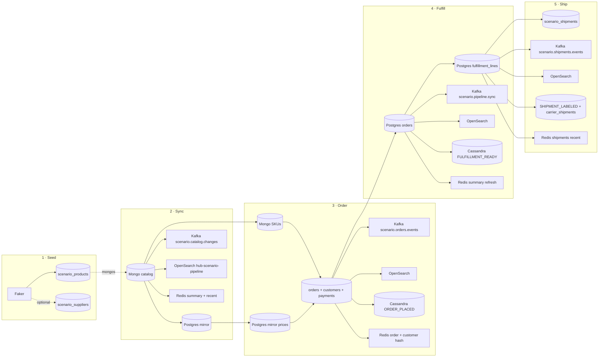
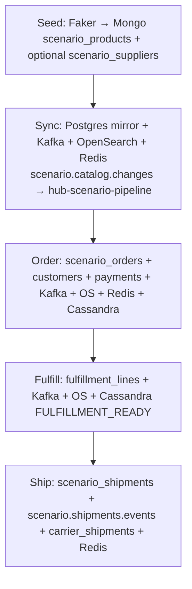
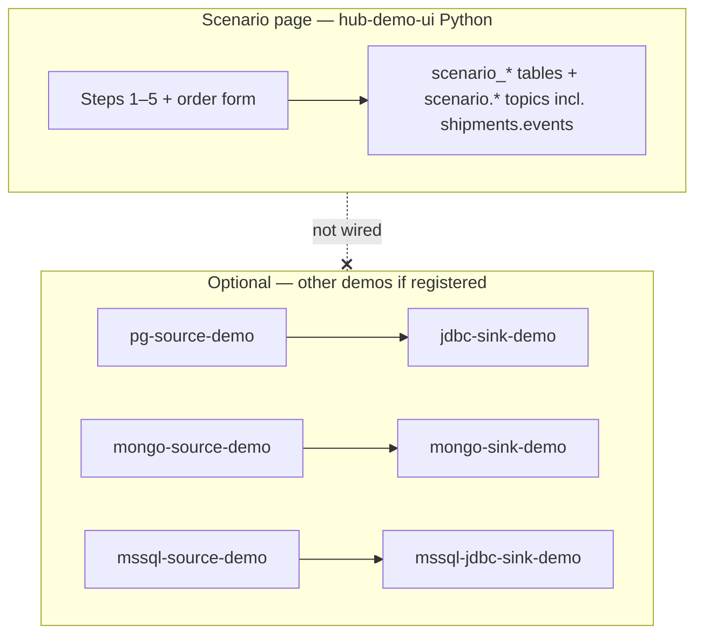

# Multi-DB scenario: diagrams, connectors, sources & sinks

**Common to Compose + Kubernetes:** [`../../../../docs/hub-and-data-flow.md`](../../../../docs/hub-and-data-flow.md) · [`../../../../docs/compose-vs-kubernetes.md`](../../../../docs/compose-vs-kubernetes.md) · [`../../../../docs/README.md`](../../../../docs/README.md)

This page matches what you see on **http://localhost:8888/scenario** (“Multi-DB scenario (Faker + pipelines)”): the **Pipeline line diagram** (horizontal), the sidebar **Flow diagram** (vertical), and the **Behind the scenes** steps (**1–5**).

Implementation: [`../demo-ui/scenario.py`](../demo-ui/scenario.py) and handlers in [`../demo-ui/app.py`](../demo-ui/app.py).

A shorter companion with the same tables: [`../README-SCENARIO-FLOW.md`](../README-SCENARIO-FLOW.md).

---

## 1. Which diagram explains this flow?

| What you are looking at | Where it lives | What it shows |
|---------------------------|----------------|---------------|
| **Pipeline line diagram** | Scenario page, main column | Steps **1 → 5** on one horizontal spine (Seed, Sync, Order, Fulfill, Ship) plus end marker. |
| **Vertical flow diagram** | Scenario page, right column | The **same five stages** top to bottom. |
| **Five-step Mermaid (horizontal)** | [Section 5](#5-mermaid-five-step-pipeline-matches-ui-logic) below | Same logic as the UI; good for GitHub / docs. |
| **End-to-end reference architecture** | [`../diagrams/00-component-context.mmd`](../diagrams/00-component-context.mmd) (+ `.svg`) | All hub systems at once; not limited to the Scenario buttons. |
| **Order / search sequence** | [`../diagrams/01-sequence-order-flow.mmd`](../diagrams/01-sequence-order-flow.mmd) | Broader “order + search + side stores” story. |
| **Scenario vs Connect overview** | [`../diagrams/06-flowchart-multi-db-faker-connect-overview.mmd`](../diagrams/06-flowchart-multi-db-faker-connect-overview.mmd) | **`scenario.*`** topics + multi-store writes vs **`demo_items`** CDC connectors. |
| **Postgres fulfillment path** | [`../diagrams/02-flowchart-postgres-path.mmd`](../diagrams/02-flowchart-postgres-path.mmd) | Detailed Postgres-shaped flows. |
| **Mongo CDC-style path** | [`../diagrams/03-flowchart-mongo-path.mmd`](../diagrams/03-flowchart-mongo-path.mmd) | **Debezium + `demo.demo_items`** (mongo-kafka demo), not `scenario_products`. |
| **Cassandra / Redis / OpenSearch** | [`../diagrams/04-flowchart-cassandra-redis-os.mmd`](../diagrams/04-flowchart-cassandra-redis-os.mmd) | Side stores including **`/scenario`** timeline + carrier shipments + Redis key patterns. |

**Takeaway:** For the **exact** Scenario buttons, trust the **UI diagrams** or the **Mermaid in sections 5–6** below. The numbered `.mmd` files under [`../diagrams/`](../diagrams/) describe the **whole** reference hub; some nodes reference **other** demos (e.g. Postgres/Mongo CDC on `demo_items`), not necessarily `scenario_*` tables.

---

## 2. How many “connectors” are running?

The word **connector** means two different things here.

### A) Kafka Connect connectors (JVM, Debezium / JDBC / Mongo sink)

The **Scenario page does not use Kafka Connect.** Data movement for the pipeline buttons is **Python in `hub-demo-ui`**: PyMongo, psycopg, kafka-python, HTTP to OpenSearch, redis-py, Cassandra driver.

If you **separately** start the stack’s **Kafka Connect** service and run the registration scripts from the other demos, you can have **up to six** connectors defined in this repo (they mirror **`demo_items`**-style paths and MSSQL, **not** `scenario_*`):

| Connector name | Type | Source | Sink |
|----------------|------|--------|------|
| `pg-source-demo` | Debezium PostgreSQL | Postgres `public.demo_items` | Kafka topic `demopg.public.demo_items` |
| `jdbc-sink-demo` | Debezium JDBC sink | That Kafka topic | Postgres table `demo_items_from_kafka` |
| `mongo-source-demo` | Debezium MongoDB | Mongo `demo.demo_items` (change streams via **mongos**) | Kafka topic prefix `demomongo` |
| `mongo-sink-demo` | MongoDB Kafka Connect sink | Topic `demomongo.demo.demo_items` | Mongo `demo.demo_items_from_kafka` |
| `mssql-source-demo` | Debezium SQL Server | Publisher `dbo.scenario_catalog_mirror_mssql` | Kafka |
| `mssql-jdbc-sink-demo` | JDBC sink | That topic | Subscriber |

Scripts: [`../../postgres-kafka/register-connectors.sh`](../../postgres-kafka/register-connectors.sh), [`../../mongo-kafka/register-mongo-connectors.sh`](../../mongo-kafka/register-mongo-connectors.sh), [`../../mssql-kafka/register-mssql-connectors.sh`](../../mssql-kafka/register-mssql-connectors.sh).  
**Count for Scenario:** **0** Kafka Connect connectors. **Count if all demo scripts are registered:** **6** connectors (still unrelated to moving **`scenario_products`** rows).

### B) Logical pipelines (what the Scenario UI runs)

| # | Function in `scenario.py` | Plain-language role |
|---|-----------------------------|---------------------|
| 1 | `op_seed_catalog` | Faker → Mongo (`scenario_products`, optional `scenario_suppliers`) |
| 2 | `op_pipeline_mongo_to_postgres_and_kafka` | Mongo → Postgres mirror + Kafka + OpenSearch + Redis (+ MSSQL when set) |
| 3 | `op_place_order` | Postgres orders + customers + payments + Kafka + OpenSearch + Cassandra + Redis |
| 4 | `op_pipeline_postgres_to_fulfillment_and_kafka` | Postgres fulfillment + Kafka + OpenSearch + Cassandra + Redis summary |
| 5 | `op_pipeline_fulfilled_to_shipments` | Postgres shipments + `scenario.shipments.events` + OpenSearch + Cassandra + Redis |

**Count:** **five** user-triggered integration steps (plus **Quick order** / **Custom order** both using step 3).

---

## 3. Source vs sink (per Scenario step)

Kafka topics ( **`scenario.`** in code):

- `scenario.catalog.changes`
- `scenario.orders.events`
- `scenario.pipeline.sync`
- `scenario.shipments.events`

OpenSearch index for mirrored pipeline documents: **`hub-scenario-pipeline`** (`SCENARIO_PIPELINE_OS_INDEX`).

### Step 1 — Seed Mongo catalog

| Role | System | Detail |
|------|--------|--------|
| Source | **Faker** (in-process) | Synthetic catalog + optional supplier fields |
| Sink | **MongoDB** | `demo.scenario_products`; optional `demo.scenario_suppliers` |

### Step 2 — Sync catalog

| Role | System | Detail |
|------|--------|--------|
| Source | **MongoDB** | Read up to **80** documents from `demo.scenario_products` |
| Sink | **PostgreSQL** | UPSERT `scenario_catalog_mirror` |
| Sink | **Kafka** | Produce `scenario.catalog.changes` |
| Sink | **OpenSearch** | Index same payload (`mongo→kafka+os`) |
| Sink | **Redis** | `LPUSH` / trim `scenario:kafka:recent`; refresh `scenario:dashboard:summary` |

### Step 3 — Place order

| Role | System | Detail |
|------|--------|--------|
| Source | **MongoDB** | SKUs (read) |
| Source | **PostgreSQL** | Prices from `scenario_catalog_mirror` when present |
| Sink | **PostgreSQL** | `scenario_orders`, `scenario_customers` UPSERT, `scenario_payments` |
| Sink | **Kafka** | `scenario.orders.events` |
| Sink | **OpenSearch** | Mirror (`api→kafka+os`) |
| Sink | **Cassandra** | `demo_hub.scenario_timeline` — `ORDER_PLACED` |
| Sink | **Redis** | `scenario:order:latest:<order_ref>`, `scenario:customer:<email>`, recent list, dashboard summary |

### Step 4 — Fulfillment

| Role | System | Detail |
|------|--------|--------|
| Source | **PostgreSQL** | Orders **without** `scenario_fulfillment_lines` yet (up to **20**) |
| Sink | **PostgreSQL** | Insert `scenario_fulfillment_lines` |
| Sink | **Kafka** | `scenario.pipeline.sync` |
| Sink | **OpenSearch** | Mirror (`postgres→kafka+os`) |
| Sink | **Cassandra** | `FULFILLMENT_READY` on `scenario_timeline` |
| Sink | **Redis** | **Dashboard summary refresh only** |

### Step 5 — Shipping labels

| Role | System | Detail |
|------|--------|--------|
| Source | **PostgreSQL** | Orders with fulfillment rows and **no** `scenario_shipments` row |
| Sink | **PostgreSQL** | Insert `scenario_shipments` |
| Sink | **Kafka** | `scenario.shipments.events` |
| Sink | **OpenSearch** | Mirror (`postgres→kafka+os`) |
| Sink | **Cassandra** | `SHIPMENT_LABELED`, `scenario_carrier_shipments` |
| Sink | **Redis** | `scenario:shipments:recent`, dashboard summary |

---

## 4. Is `demo.scenario_products` sharded?

| Question | Answer |
|----------|--------|
| Does the app talk to a sharded **cluster**? | **Yes.** `MONGO_URI` defaults to **`mongodb://mongo-mongos1:27017`** (a **mongos** router). |
| Is **`demo.scenario_products`** registered with **`sh.shardCollection`** in this repo? | **No.** [`../../mongo-kafka/prepare-demo-collections.sh`](../../mongo-kafka/prepare-demo-collections.sh) shards **`demo.demo_items`** and **`demo.demo_items_from_kafka`** for the CDC demo, not the scenario catalog. |
| Where does `scenario_products` live then? | As an **unsharded** collection in the sharded cluster: it stays on the **primary shard** until you explicitly shard it. |
| Is that a problem for the Scenario demo? | No—the demo only needs a normal collection. To shard it like `demo_items`, run **`sh.shardCollection("demo.scenario_products", …)`** once (e.g. hashed on `_id` or `sku`) via **mongosh** or extend the prepare script. |

---

## 5. Mermaid: five-step pipeline (matches UI logic)

---

## 6. Mermaid: vertical summary (sidebar-style)

---

## 7. Mermaid: Scenario vs optional Kafka Connect (scope)

The dotted edge means **no automatic link**: Scenario pipelines and these connectors operate on **different** table/collection names unless you change the code or connector config.

---

## 8. Quick reference

| Item | Value |
|------|--------|
| UI | http://localhost:8888/scenario |
| Mongo | `demo.scenario_products`, optional `demo.scenario_suppliers` |
| Postgres | `scenario_catalog_mirror`, `scenario_orders`, `scenario_fulfillment_lines`, `scenario_customers`, `scenario_payments`, `scenario_shipments` |
| Cassandra | `demo_hub.scenario_timeline`, `demo_hub.scenario_carrier_shipments` |
| Redis | `scenario:dashboard:summary`, `scenario:kafka:recent`, `scenario:order:latest:*`, `scenario:customer:*`, `scenario:shipments:recent` |

Stack and ports: [`../../../../docker-compose.yml`](../../../../docker-compose.yml). Mongo topology: [`../../mongo-sharded/README.md`](../../mongo-sharded/README.md).
