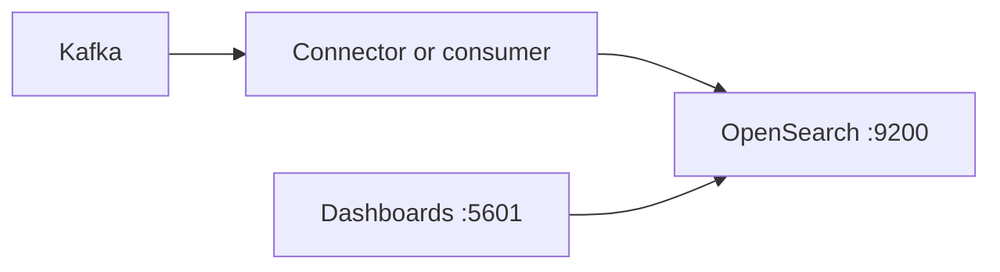

# OpenSearch + OpenSearch Dashboards

**OpenSearch** (search / analytics engine) and **OpenSearch Dashboards** are defined in **`../docker-compose.yml`** as **`opensearch`** and **`opensearch-dashboards`** on **`mcac_net`**.

This demo runs a **single-node** cluster with the **security plugin disabled** so you can use plain HTTP on port **9200** (suitable for local work only).

## Host ports

| Service | Port | URL (host) |
|---------|------|------------|
| OpenSearch API | **9200** | http://localhost:9200 |
| OpenSearch Performance Analyzer (optional) | **9600** | — |
| OpenSearch Dashboards | **5601** | http://localhost:5601 |

**Metrics:** **`opensearch-exporter`** ([Prometheus **Elasticsearch** exporter](https://github.com/prometheus-community/elasticsearch-exporter)) scrapes **`http://opensearch:9200`** on the Docker network; Prometheus job **`opensearch_demo`** (no host port required).

Inside Docker, apps use **`http://opensearch:9200`** for the REST API.

## Authentication (this demo)

With **`DISABLE_SECURITY_PLUGIN=true`**, there is **no** username/password on the OpenSearch HTTP API. **Do not expose these ports to the internet.**

For production, enable the security plugin, TLS, and strong admin credentials.

## Start

From **`dashboards/demo`**:

```bash
docker compose up -d opensearch opensearch-dashboards opensearch-exporter
```

First start can take **1–2 minutes** (JVM + bootstrapping). Watch health:

```bash
docker compose ps opensearch opensearch-dashboards
curl -s http://localhost:9200 | head
```

## Quick API checks

```bash
curl -s http://localhost:9200
curl -s http://localhost:9200/_cluster/health?pretty
```

Create a tiny index:

```bash
curl -s -X PUT "http://localhost:9200/demo-docs" -H 'Content-Type: application/json' -d '{"settings":{"index":{"number_of_shards":1,"number_of_replicas":0}}}'
curl -s -X POST "http://localhost:9200/demo-docs/_doc" -H 'Content-Type: application/json' -d '{"title":"hello","source":"demo"}'
curl -s "http://localhost:9200/demo-docs/_search?pretty"
```

Then open **Dashboards** at http://localhost:5601 and create an index pattern for **`demo-docs`**.

## Data

Persistent volume **`opensearch_data`**.

## Grafana (import by dashboard ID)

The exporter emits **`elasticsearch_*`** metrics (OpenSearch is API-compatible with the endpoints the exporter uses). After Prometheus is scraping **`opensearch_demo`**, import a dashboard and use the **`prometheus`** datasource:

| ID | Name | Link |
|----|------|------|
| **14191** | **Elasticsearch** Exporter Quickstart (works well with `elasticsearch-exporter`) | [grafana.com/grafana/dashboards/14191](https://grafana.com/grafana/dashboards/14191) |
| **2322** | Elasticsearch — cluster overview (older community layout) | [grafana.com/grafana/dashboards/2322](https://grafana.com/grafana/dashboards/2322) |

**Variables:** set **job** to **`opensearch_demo`** (and **instance** **`opensearch-exporter:9114`** if the dashboard filters by instance). In **Explore**, verify: `elasticsearch_cluster_health_status{job="opensearch_demo"}` or `up{job="opensearch_demo"}`.

**Note:** Dashboards aimed at the **Elasticsearch** 8 **Prometheus plugin** or **Grafana OpenSearch datasource** (not Prometheus) use different IDs (e.g. [19504](https://grafana.com/grafana/dashboards/19504)); this stack uses **Prometheus + elasticsearch-exporter** only.

## How this fits with Kafka / CDC (optional)

A typical pattern: **Kafka topic** → small consumer or **Kafka Connect OpenSearch sink** → **OpenSearch** indexes. This compose file does **not** include a connector or consumer; add one later if you want CDC or log documents indexed automatically.



## Versions

Images are pinned to **OpenSearch 2.11.1** and matching **OpenSearch Dashboards 2.11.1**.

## Further reading

- Main demo index: **[`../README.md`](../README.md)**  
- **Redis** (password-protected cache on the same network): **[`../redis/README.md`](../redis/README.md)**
