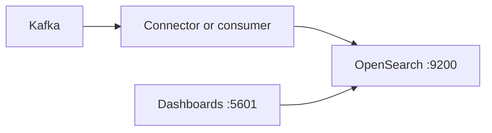

# OpenSearch + OpenSearch Dashboards

**OpenSearch** (search / analytics engine) and **OpenSearch Dashboards** are defined in **`../docker-compose.yml`** as **`opensearch`** and **`opensearch-dashboards`** on **`mcac_net`**.

This demo runs a **single-node** cluster with the **security plugin disabled** so you can use plain HTTP on port **9200** (suitable for local work only).

## Host ports

| Service | Port | URL (host) |
|---------|------|------------|
| OpenSearch API | **9200** | http://localhost:9200 |
| OpenSearch Performance Analyzer (optional) | **9600** | — |
| OpenSearch Dashboards | **5601** | http://localhost:5601 |

**Metrics:** **`opensearch-exporter`** ([Prometheus **Elasticsearch** exporter](https://github.com/prometheus-community/elasticsearch-exporter)) scrapes **`http://opensearch:9200`** on the Docker network; Prometheus job **`opensearch_demo`** (no host port required).

Inside Docker, apps use **`http://opensearch:9200`** for the REST API.

## Connect (clients)

| From | Base URL | Notes |
|------|----------|--------|
| Your machine (browser, curl, app) | **`http://localhost:9200`** | With the demo compose ports published |
| Another container on **`mcac_net`** | **`http://opensearch:9200`** | e.g. **`hub-demo-ui`**, **`opensearch-exporter`** |
| OpenSearch Dashboards (UI) | **`http://localhost:5601`** | Kibana-compatible UI; Dev Tools runs `_search` / `_cat` |

This demo has **no HTTP auth** on OpenSearch (security plugin off). Use any HTTP client or an OpenSearch/Elasticsearch-compatible SDK targeting that base URL.

```bash
curl -s http://localhost:9200/
curl -s 'http://localhost:9200/_cluster/health?pretty'
curl -s 'http://localhost:9200/hub-orders/_search?pretty' -H 'Content-Type: application/json' -d '{"size":5,"query":{"match_all":{}}}'
```

Python example (same as the hub UI): `httpx.get("http://localhost:9200/…")` or `httpx.post("http://opensearch:9200/_bulk", …)` from inside the stack.

### JDBC tools (DbVisualizer, DBeaver, etc.)

**Do not use Elastic’s X-Pack SQL JDBC driver** (`org.elasticsearch.xpack.sql.jdbc.EsDriver`) against OpenSearch. That driver enforces **Elasticsearch ≥ 9.2** and compares the server’s version string; OpenSearch **2.11.x** fails that check with an error like *“only compatible with Elasticsearch version 9.2 or newer; attempting to connect to a server version 2.11.1”*. That is expected: OpenSearch is a separate product with its own versioning, not Elasticsearch 2.x.

For this demo, prefer:

- **OpenSearch Dashboards** → **Dev Tools** (`http://localhost:5601`) for `_search`, `_cat`, and other REST requests.
- **curl** / **httpx** / **`opensearch-py`** or **`elasticsearch`** Python clients against **`http://localhost:9200`** (REST index/search APIs, not Elastic JDBC).
- If you specifically need **SQL over OpenSearch**, use the [OpenSearch SQL plugin](https://opensearch.org/docs/latest/search-plugins/sql/index/) and tools documented for that stack (not the Elastic JDBC driver).

## Authentication (this demo)

With **`DISABLE_SECURITY_PLUGIN=true`**, there is **no** username/password on the OpenSearch HTTP API. **Do not expose these ports to the internet.**

For production, enable the security plugin, TLS, and strong admin credentials.

## Start

From **`dashboards/demo`**:

```bash
docker compose up -d opensearch opensearch-dashboards opensearch-exporter
```

First start can take **1–2 minutes** (JVM + bootstrapping). Watch health:

```bash
docker compose ps opensearch opensearch-dashboards
curl -s http://localhost:9200 | head
```

## Quick API checks

```bash
curl -s http://localhost:9200
curl -s http://localhost:9200/_cluster/health?pretty
```

Create a tiny index:

```bash
curl -s -X PUT "http://localhost:9200/demo-docs" -H 'Content-Type: application/json' -d '{"settings":{"index":{"number_of_shards":1,"number_of_replicas":0}}}'
curl -s -X POST "http://localhost:9200/demo-docs/_doc" -H 'Content-Type: application/json' -d '{"title":"hello","source":"demo"}'
curl -s "http://localhost:9200/demo-docs/_search?pretty"
```

Then open **Dashboards** at http://localhost:5601 and create an index pattern for **`demo-docs`**.

## Data

Persistent volume **`opensearch_data`**.

## Grafana (import by dashboard ID)

The exporter emits **`elasticsearch_*`** metrics (OpenSearch is API-compatible with the endpoints the exporter uses). After Prometheus is scraping **`opensearch_demo`**, import a dashboard and use the **`prometheus`** datasource:

| ID | Name | Link |
|----|------|------|
| **14191** | **Elasticsearch** Exporter Quickstart (works well with `elasticsearch-exporter`) | [grafana.com/grafana/dashboards/14191](https://grafana.com/grafana/dashboards/14191) |
| **2322** | Elasticsearch — cluster overview (older community layout) | [grafana.com/grafana/dashboards/2322](https://grafana.com/grafana/dashboards/2322) |

**Variables:** set **job** to **`opensearch_demo`** (and **instance** **`opensearch-exporter:9114`** if the dashboard filters by instance). In **Explore**, verify: `elasticsearch_cluster_health_status{job="opensearch_demo"}` or `up{job="opensearch_demo"}`.

**Note:** Dashboards aimed at the **Elasticsearch** 8 **Prometheus plugin** or **Grafana OpenSearch datasource** (not Prometheus) use different IDs (e.g. [19504](https://grafana.com/grafana/dashboards/19504)); this stack uses **Prometheus + elasticsearch-exporter** only.

## How this fits with Kafka / CDC (optional)

A typical pattern: **Kafka topic** → small consumer or **Kafka Connect OpenSearch sink** → **OpenSearch** indexes. This compose file does **not** include a connector or consumer; add one later if you want CDC or log documents indexed automatically.



## Versions

Images are pinned to **OpenSearch 2.11.1** and matching **OpenSearch Dashboards 2.11.1**.

## Troubleshooting

### Dashboards returns HTTP 500; logs show `flood-stage watermark` / `.kibana_1` read-only

OpenSearch protects the disk by putting indices into **`read_only_allow_delete`** when free space drops below the **flood-stage** watermark. **OpenSearch Dashboards** stores its metadata in **`.kibana_*`** indices; when those are read-only, the UI answers **500** even though `curl http://localhost:9200/_cluster/health` may still show **yellow** or **green**.

**Fix (in order):**

1. **Free disk** on the machine that holds Docker/Orchestrator storage (OrbStack/Docker Desktop VM, build cache, old images). If the volume stays over-full, the cluster can block again immediately.
2. From **`dashboards/demo`**, run the helper (disables disk threshold checks for this **local** demo cluster and clears the read-only flag):

   ```bash
   chmod +x opensearch/fix-disk-flood-readonly.sh
   ./opensearch/fix-disk-flood-readonly.sh
   docker compose restart opensearch-dashboards
   ```

   Or the same steps manually:

   ```bash
   curl -sS -X PUT 'http://localhost:9200/_cluster/settings' \
     -H 'Content-Type: application/json' \
     -d '{"persistent":{"cluster.routing.allocation.disk.threshold_enabled":false}}'
   curl -sS -X PUT 'http://localhost:9200/*/_settings' \
     -H 'Content-Type: application/json' \
     -d '{"index.blocks.read_only_allow_delete":null}'
   ```

   Turning **`threshold_enabled`** off is appropriate for a **single-node dev** volume on a laptop; do **not** use that as a production default.

3. Inspect shard / disk signals: `curl -s 'http://localhost:9200/_cat/allocation?v'` and host **`df -h`**.

## Further reading

- Main demo index: **[`../README.md`](../README.md)**  
- **Redis** (password-protected cache on the same network): **[`../redis/README.md`](../redis/README.md)**
