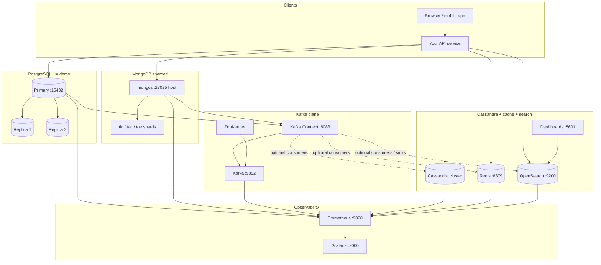
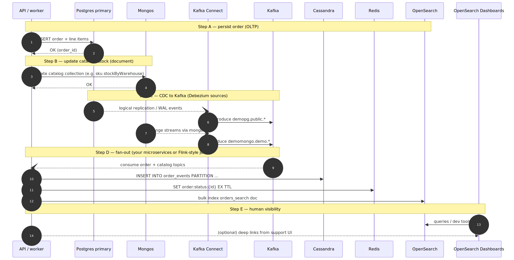
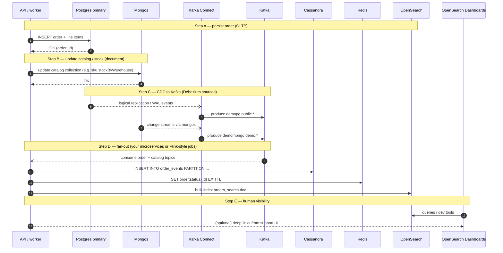
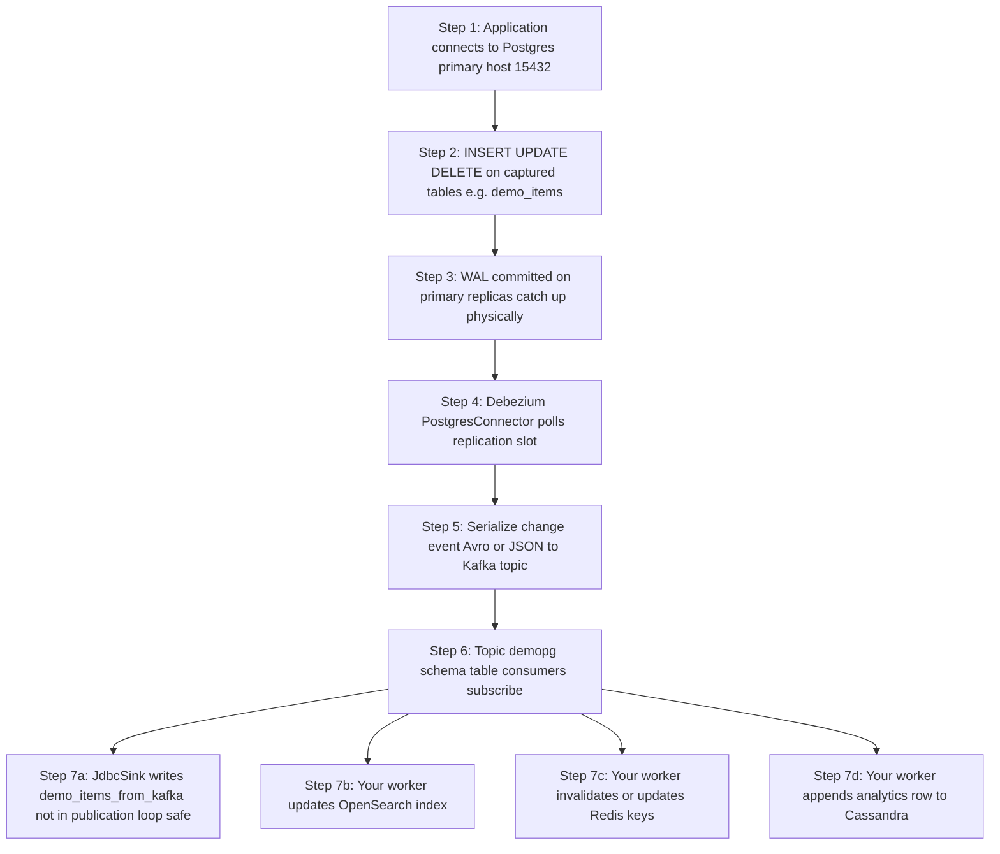
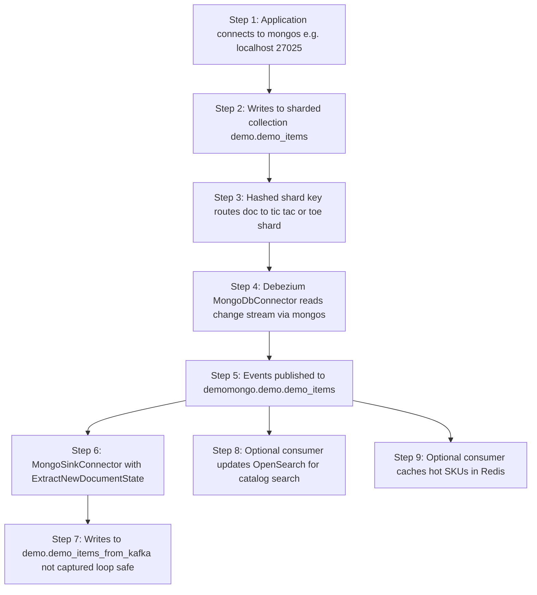
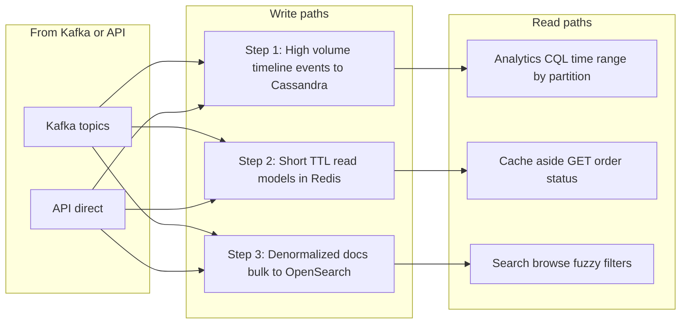

# Realtime orders & search hub (reference scenario)

This folder describes a **single coherent real-time story** across everything in **`../docker-compose.yml`**:

| System | Role in this scenario |
|--------|------------------------|
| **PostgreSQL** | System of record for **orders** and payments-oriented rows; **Debezium** captures `demo_items`-style tables to Kafka (same pattern as **`../postgres-kafka/`**). |
| **MongoDB (sharded)** | Catalog / documents that change often; **Debezium Mongo** → Kafka (**`../mongo-kafka/`**). |
| **Kafka + Connect** | Event backbone; source and sink connectors you already run. |
| **Cassandra** | High-volume **order events** / timeline (append-heavy, wide rows)—good fit for MCAC metrics and **`../cassandra/`** topology. |
| **Redis** | **Hot cache**: latest order status, product availability snapshot, rate limits (**`../redis/README.md`**). |
| **OpenSearch** | **Full-text search** and customer-facing browse (indexes built from Kafka topics or denormalized writes). |
| **Prometheus + Grafana** | End-to-end observability (**`../observability/`**). |

This is a **reference architecture** you can implement incrementally: the repo already brings up the infrastructure; connectors and app code can follow the flows below.

---

## Scenario in one paragraph

A customer places an order: the **API** persists the order in **Postgres** and updates **Mongo** catalog stock. **Debezium** streams both changes to **Kafka**. A **consumer** (or **sink**) updates **OpenSearch** so the “my orders” and catalog search UI stay current; another path writes an **event** to **Cassandra** for analytics and pushes a **short-TTL cache** entry in **Redis** for the order status API. **Prometheus** scrapes brokers, DBs, Redis, OpenSearch exporters, and **Grafana** gives you one place to see lag, errors, and saturation.

---

## Browser hub demo UI (one click → all stores)

Service **`hub-demo-ui`** in **`../docker-compose.yml`** serves a small page on **http://localhost:8888**.

1. Start the full demo stack (includes **`mongo-kafka-prepare`** so Mongo collections exist): use **`../start-full-stack.sh`** or `docker compose build hub-demo-ui && docker compose up -d`.
2. Open **http://localhost:8888** and click **Create demo order**.
3. The response JSON shows per-store success and the shared **`order_id`**. The page also links to Grafana, Prometheus, OpenSearch Dashboards, and Kafka Connect.

**Grafana:** open **http://localhost:3000** — separate provisioned JSON dashboards under **`../../grafana/generated-dashboards/`** (e.g. **`mongodb-tictactoe-detailed.json`**, **`redis-demo-overview.json`**, **`kafka-cluster-overview.json`**, **`cassandra-condensed.json`**, **`overview.json`**). OpenSearch cluster metrics: import a community **Elasticsearch exporter** dashboard and point the **job** variable at **`opensearch_demo`** (see **`../opensearch/README.md`**).

**Tunable load:** open **http://localhost:8888/workload** to drive batches with **total records**, **batch size**, **payload size (KB)**, and choose **Postgres / Mongo / Redis / Cassandra / OpenSearch**. OpenSearch writes go to index **`hub-workload`** (large payloads × many rows can stress disk; stay within the UI limits).

| Store | What the UI writes | Quick verify |
|--------|-------------------|--------------|
| **Postgres** | Row in **`demo_items`** (CDC to Kafka if the Postgres connector is registered) | JSON shows `id` / `name`; or `SELECT * FROM demo_items ORDER BY id DESC LIMIT 5;` on **15432** |
| **Mongo** | Doc in **`demo.demo_items`** with `source: "hub-demo-ui"` | `db.demo_items.find({ source: "hub-demo-ui" }).sort({ _id: -1 }).limit(5)` on mongos **27025** |
| **Redis** | Key **`hub:order:<order_id>`** (TTL 1h) | JSON shows `read_back`; or `redis-cli -a demoredispass GET hub:order:<uuid>` |
| **Cassandra** | Row in **`demo_hub.orders`** | JSON shows row; or `SELECT * FROM demo_hub.orders LIMIT 10;` via **cqlsh** (e.g. **19442**) |
| **OpenSearch** | Document in index **`hub-orders`** | **GET** `http://localhost:9200/hub-orders/_doc/<order_id>?pretty` or in **OpenSearch Dashboards** → **Dev Tools**: `GET hub-orders/_search?q=hub-demo-ui&pretty` |

**OpenSearch Dashboards (5601):** after a few writes, under **Management** → **Index patterns**, create **`hub-orders*`** then open **Discover** to search by `order_id` or `label`. Dev Tools is fastest for ad hoc `GET`/`POST`.

Source: **[`demo-ui/`](demo-ui/)** (FastAPI + Dockerfile).

---

## Entire workflow (diagrams)

**If you only see raw `flowchart` / `sequenceDiagram` text:** your preview does not render Mermaid. That is normal in **Cursor / VS Code** unless you add a Mermaid-capable Markdown preview (e.g. extension “Markdown Preview Mermaid Support”). **GitHub** renders Mermaid in `README.md` on the repo website. **Below each heading, the same diagram is also inlined as an SVG** so it shows in any viewer that supports images.

Canonical editable sources: [`.mmd` files in `diagrams/`](diagrams/).

### 1. Component context (stack + data paths)



<details>
<summary>Mermaid source (for GitHub / compatible viewers)</summary>



</details>

### 2. End-to-end sequence (one order)



<details>
<summary>Mermaid source (for GitHub / compatible viewers)</summary>



</details>

### 3. Postgres → Kafka → downstream (stepped)



<details>
<summary>Mermaid source (for GitHub / compatible viewers)</summary>



</details>

### 4. Mongo (sharded) → Kafka → sink (stepped)



<details>
<summary>Mermaid source (for GitHub / compatible viewers)</summary>



</details>

### 5. Cassandra, Redis, OpenSearch (writes vs reads)



<details>
<summary>Mermaid source (for GitHub / compatible viewers)</summary>



</details>

---

## Phase map (what to build vs what exists)

| Phase | Status in repo | Your work |
|-------|----------------|-----------|
| Infra up | Compose: PG, Mongo sharded, Kafka, Connect, Cassandra, Redis, OpenSearch, Prometheus, Grafana | `docker compose up` from **`dashboards/demo`** per area READMEs |
| Postgres CDC | **`postgres-kafka/register-connectors.sh`** | Tables, publication, sink table not in publication |
| Mongo CDC | **`mongo-kafka/register-mongo-connectors.sh`** + **`mongo-kafka-prepare`** | Ensure topics and sinks match naming |
| Cassandra writes | MCAC agent on cassandra nodes | App or batch job writing order_events |
| Redis | **`redis`** + password | App: SET order:{id} with TTL |
| OpenSearch | **`opensearch`** + Dashboards | Index pipeline from Kafka or REST bulk |
| Metrics | **`prometheus.yaml`** jobs | Restart Prometheus after edits |

---

## Step-by-step workflows (by data plane)

### A. Postgres row → Kafka → (optional) sink / consumers

1. App **INSERT/UPDATE** on primary (e.g. `demo_items` or `orders`) — host port **15432** (`../postgres-kafka/README.md`).
2. WAL + **logical replication** on primary; **PostgresConnector** in Connect consumes slot (**`8083`**).
3. Event on topic (e.g. `demopg.public.demo_items`).
4. **JdbcSinkConnector** (or your consumer) can mirror to another table **not** in the publication to avoid loops.
5. **Your service** (not in compose) consumes the topic → **OpenSearch** bulk index / **Redis** cache invalidate-set / **Cassandra** insert.

### B. Mongo document → Kafka → sink

1. App writes **`demo.demo_items`** via **mongos** (**`../mongo-kafka/README.md`**).
2. **MongoDbConnector** (change streams via mongos) → topic (e.g. `demomongo.demo.demo_items`).
3. **Mongo sink** → `demo.demo_items_from_kafka` (loop-safe; separate collection).
4. Same **your service** pattern: fan-out to **OpenSearch**/ **Redis** / analytics.

### C. Cassandra + Redis + OpenSearch (application pattern)

1. **Cassandra**: append **order_events** (clustering by time, partition by `order_id` or tenant)—see **`../cassandra/README.md`** for CQL access.
2. **Redis**: `SET order:status:{id} {json} EX 300` after each state change (read-mostly API).
3. **OpenSearch**: index **`orders-search-{id}`** with denormalized fields for search; refresh policy per SLA.

### D. Observability (always on)

1. **Prometheus** **http://localhost:9090/targets** — PG exporters, `kafka_pgdemo`, `mongodb`, `redis_demo`, `opensearch_demo`, `mcac`, etc. Restart after **`prometheus.yaml`** changes.
2. **Grafana** **http://localhost:3000** — Kafka, Redis, Mongo, Cassandra dashboards in **`../../grafana/generated-dashboards/`**.

---

## How to test this scenario

Use **http://localhost:8888** (**`hub-demo-ui`**) for one-click writes to Postgres, Mongo, Redis, Cassandra, and OpenSearch; then use the table below and Grafana / Connect for CDC and metrics.

### 1. Start the demo Compose stack

From **`dashboards/demo`**:

```bash
cd /path/to/metric-collector-for-apache-cassandra/dashboards/demo
chmod +x start-full-stack.sh
./start-full-stack.sh
```

Or manually: `export PROJECT_VERSION=...`, `docker compose build mcac kafka-connect hub-demo-ui`, then `docker compose up -d`. Use **`demo/docker-compose.yml`**, not **`dashboards/docker-compose.yaml`** (that parent file is Prometheus + Grafana only).

Wait until Postgres, Mongo sharded chain, Kafka, Connect, Redis, OpenSearch, Cassandra (if enabled), Prometheus, and Grafana are healthy. See **[`../README.md`](../README.md)** for partial starts if you do not want every service.

### 2. Smoke-test each plane (no custom code)

| Check | Command or URL |
|--------|----------------|
| **Hub demo UI** | **http://localhost:8888** — click *Create demo order*; JSON shows each store. |
| Kafka Connect | `curl -s http://localhost:8083/` — should return Connect worker JSON. |
| **Postgres CDC** | From **`../postgres-kafka/`**: `chmod +x register-connectors.sh && ./register-connectors.sh` then insert on primary **:15432** and confirm **`demopg.public.demo_items`** has messages (Kafka UI or **`kafka-console-consumer`** per **`../kafka/README.md`**). Full walkthrough: **[`../postgres-kafka/README.md`](../postgres-kafka/README.md)**. |
| **Mongo CDC** | Build Connect if needed: `docker compose build kafka-connect && docker compose up -d kafka-connect`. From **`../mongo-kafka/`**: `./register-mongo-connectors.sh` then `curl -s http://localhost:8083/connectors/mongo-source-demo/status` — tasks **RUNNING**. Details: **[`../mongo-kafka/README.md`](../mongo-kafka/README.md)**. |
| **Redis** | `redis-cli -h 127.0.0.1 -p 6379 -a demoredispass ping` → **PONG** (**[`../redis/README.md`](../redis/README.md)**). |
| **OpenSearch** | `curl -s http://localhost:9200` — cluster info JSON (**[`../opensearch/README.md`](../opensearch/README.md)**). |
| **Prometheus** | **http://localhost:9090/targets** — exporters **UP** for the jobs you care about. |
| **Grafana** | **http://localhost:3000** — open Kafka / Mongo / Redis (and Cassandra) dashboards from provisioning. |

### 3. What “fully tested” means for this README

- **`hub-demo-ui`:** direct writes to Postgres `demo_items`, Mongo `demo.demo_items`, Redis `hub:order:*`, Cassandra `demo_hub.orders`, and OpenSearch `hub-orders` with verification in the browser JSON.
- **Kafka / CDC:** after registers scripts, the same Postgres and Mongo writes also produce **Kafka** topics; use Connect status + Grafana Kafka dashboard to confirm.
- **Custom fan-out:** optional extra consumers from Kafka → other indexes or tables are still yours to add.

### 4. Optional: one-liner greps for connector names

```bash
curl -s http://localhost:8083/connectors | jq .
```

You should see the Postgres and Mongo connector names once **`register-connectors.sh`** / **`register-mongo-connectors.sh`** have been run successfully.

---

## Diagrams (Mermaid sources + rendered SVG)

The same diagrams are **embedded above** under **Entire workflow (diagrams)**. Edit the **`.mmd`** files in [`diagrams/`](diagrams/) as the canonical source, then refresh the README copy if you change structure or labels. Each diagram also has a **`.svg`** for viewers that do not render Mermaid. Regenerate SVGs after editing with the commands in the next section.

| Source | Rendered | Contents |
|--------|----------|-----------|
| [`diagrams/00-component-context.mmd`](diagrams/00-component-context.mmd) | [`diagrams/00-component-context.svg`](diagrams/00-component-context.svg) | All services and external “app” on one diagram |
| [`diagrams/01-sequence-order-flow.mmd`](diagrams/01-sequence-order-flow.mmd) | [`diagrams/01-sequence-order-flow.svg`](diagrams/01-sequence-order-flow.svg) | End-to-end **sequence** (`autonumber`) |
| [`diagrams/02-flowchart-postgres-path.mmd`](diagrams/02-flowchart-postgres-path.mmd) | [`diagrams/02-flowchart-postgres-path.svg`](diagrams/02-flowchart-postgres-path.svg) | **Stepped** Postgres CDC path |
| [`diagrams/03-flowchart-mongo-path.mmd`](diagrams/03-flowchart-mongo-path.mmd) | [`diagrams/03-flowchart-mongo-path.svg`](diagrams/03-flowchart-mongo-path.svg) | **Stepped** Mongo CDC path |
| [`diagrams/04-flowchart-cassandra-redis-os.mmd`](diagrams/04-flowchart-cassandra-redis-os.mmd) | [`diagrams/04-flowchart-cassandra-redis-os.svg`](diagrams/04-flowchart-cassandra-redis-os.svg) | Cassandra, Redis, OpenSearch fan-out |

---

## Regenerate SVGs (from this directory)

```bash
cd realtime-orders-search-hub
npx --yes @mermaid-js/mermaid-cli@11.4.0 -i diagrams/00-component-context.mmd -o diagrams/00-component-context.svg -b transparent
npx --yes @mermaid-js/mermaid-cli@11.4.0 -i diagrams/01-sequence-order-flow.mmd -o diagrams/01-sequence-order-flow.svg -b transparent
npx --yes @mermaid-js/mermaid-cli@11.4.0 -i diagrams/02-flowchart-postgres-path.mmd -o diagrams/02-flowchart-postgres-path.svg -b transparent
npx --yes @mermaid-js/mermaid-cli@11.4.0 -i diagrams/03-flowchart-mongo-path.mmd -o diagrams/03-flowchart-mongo-path.svg -b transparent
npx --yes @mermaid-js/mermaid-cli@11.4.0 -i diagrams/04-flowchart-cassandra-redis-os.mmd -o diagrams/04-flowchart-cassandra-redis-os.svg -b transparent
```

---

## Related docs

| Topic | Link |
|-------|------|
| Demo index | [`../README.md`](../README.md) |
| Postgres + Kafka | [`../postgres-kafka/README.md`](../postgres-kafka/README.md) |
| Mongo + Kafka | [`../mongo-kafka/README.md`](../mongo-kafka/README.md) |
| Mongo sharding | [`../mongo-sharded/README.md`](../mongo-sharded/README.md) |
| Cassandra | [`../cassandra/README.md`](../cassandra/README.md) |
| Kafka / Connect | [`../kafka/README.md`](../kafka/README.md) |
| Redis | [`../redis/README.md`](../redis/README.md) |
| OpenSearch | [`../opensearch/README.md`](../opensearch/README.md) |
| Observability | [`../observability/README.md`](../observability/README.md) |
